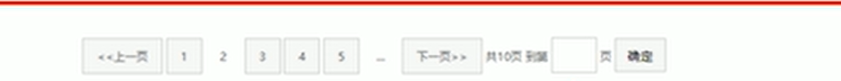

[TOC]


# 一. HTML 标签

## 1.html语法规范

### 1.1 html语法规范

html标签是由==尖括号包围的关键词==，如< html>

html标签通常是==成对出现==，称为==双标签==，第一个称为开始标签，第二个是结束标签

有特殊标签必须是单个标签，如< br />，称为单标签，

### 1.2 标签关系

双标签关系可以分为两类：==包含关系==和==并列关系==

**包含关系**（父子关系）

```typescript
<head>
    <title> </title>
</head>
```

**并列关系**

```typescript
<head></head>
<body></body>
```

## 2.html基本结构标签

### 2.1 html页面

每个页面都会有一个基本的结构标签(==也称骨架标签==)，页面内容也是这些基本标签上书写，==html页面也称HTML文档==

| 标签名            | 定义       | 说明                                                 |
| ----------------- | ---------- | ---------------------------------------------------- |
| < html>< /html>   | HTML标签   | 页面中最大的标签，称为**根标签**                     |
| < head>< /head>   | 文档的头部 | 注意在head标签中我们必须要设置的标签是title          |
| < title>< /title> | 文档的标题 | 让页面拥有一个属于自己的页面标题                     |
| < body>< /body>   | 文档的主体 | 元素包含文档的所有内容，页面内容基本都是放到body里面 |

**在vs code中 一个 ==!== 自动生成骨架标签**

## 3. 网页开发工具

vscode工具生成骨架标签新增代码：

```typescript
1.<!DOCTYPE>标签
2.lang语言
3.charset字符集
```

### 3.1 文档类型声明标签

< !DOCTYPE>文档类型声明，作用是告诉浏览器==使用哪种HTML版本==来显示网页

```
<!DOCTYPE html> //意思是使用最新的html5来显示网页
注意：
1.<!DOCTYPE>声明位于文档最前面的位置，处于<html>标签之前
2.<!DOCTYPE>不是HTML标签，他就是文档类型声明标签
```

### 3.2 lang 语言种类

用来定义当前文档显示的语言

1. ==en== 定义语言为英语
2. ==zh-CN==定义语言为中文

### 3.3 字符集

字符集是多个字符的集合，以便计算机能够识别和存储各种文字

在< head>标签内，可以通过< meta>标签的charset属性来规定html文档使用哪种字符编码

```
<meta charset= "UTF-8"/>
```

charset常用的值有：GB2312,BUG5,GBK和UTF-8,其中UTF-8称为万国码，

## 4. HTML常用标签

### 4.1 标签语义

根据标签的语义，在合适的地方给一个合适的标签，可以让页面更加清晰

### 4.2 标题标签 < h1>~< h6>

```
<h1>一级标签</h1>
```

单词head的缩写，意味头部、标签

**标签语义：**作为标题使用，并且根据重要性递减

**特点：**1. 加了标签的文字会加粗，字号也会依次变大

​            2.一个标题独占一行

### 4.3 段落和换行标签< p>与< br/>

在页面中，把文字有条理地显示出来，就需要将这些文字分段显示。

在HTML标签中，< p>标签用于==定义段落==，它可以将整个网页分为若干段落

```
<p> 段落标签</p>
```

单词 paragraph 的缩写，意为段落

**标签语言：**可以把html文档分割为若干段落

**特点：**1. 文本在一个段落中会根据浏览器窗口的大小自动换行

​           2.段落之间保留空隙


如果希望某段文本强制换行，就需要使用换行标签< br/>

```
<br/>
```

单词break的缩写，意味打断，换行

**标签语义:**强制换行。

**特点：**1.是单个标签

​            2.只是简单的开始新的一行，与段落不同，段落会插入垂直的间距

### 4.4 文本格式化标签(加粗、斜体等)

有时需要为文字设置 **粗体**、*斜体*和<ins>下划线</ins> 等效果时，就需要用到html中的文本格式化标签，使文字以特殊的文本显示

**标签语义：**突出重要性

| 语义   | 标签                             | 说明                 |
| ------ | -------------------------------- | -------------------- |
| 加粗   | < strong></ strong> 或 < b>< /b> | < strong>语义更强    |
| 倾斜   | < em>< /em> 或 < i>< /i>         | < em>语义更强        |
| 删除线 | < del>< /del> 或 < s>< /s>       | 即文本中间有个删除线 |
| 下划线 | < ins>< /ins> 或 < u>< /u>       |                      |

### 4.5 < div>和 < span>标签

< div>和< span>是没有语义的，是一个盒子用来装内容的

div:是division 的缩写，表示分割、分区

span:意为跨度、跨距

**特点：**1.< div>标签是用来布局的，但是现在一行 只能放一个 < div>，即独占一行。大盒子

​            2. < span>标签用来布局，一行上可以放多个< span>。小盒子

### 4.6 图像标签和路径

####  4.6.1 图像标签< img>

在HTML标签中，< img>标签用于定义HTML页面中的图像

```typescript

```

单词 image的缩写，意为 图像

==src==是< img>标签的==必须属性==，用于==指定图像文件的路劲和文件名==

其他属性：这些属性只要是添加了图片的盒子都可以用

| 属性   | 属性值   | 说明                                     |
| ------ | -------- | ---------------------------------------- |
| src    | 图片路径 | 必须属性                                 |
| alt    | 文本     | 替换文本，当图像不能显示的时候显示的文字 |
| title  | 文本     | 提示文本，鼠标放到图像上，显示的文字     |
| width  | 像素     |                                          |
| height | 像素     |                                          |
| border | 像素     | 设置图像的边框粗细                       |

<strong>使用时的注意点：</strong>1.图像标签可以拥有多个属性，必须写在标签名后面。

​                               2.属性不分先后顺序，相互之间用空格隔开

​                               3.属性采用键值对的格式，即属性="属性值"

​                               4.若引入图片时图片大于盒子的宽高，可在css中设置图片的width：100%表示与父元素宽高一致。

#### 4.6.2 路径

1.**目录文件夹和根目录**：

**目录文件夹**：即普通文件夹，存放做页面所需相关材料，如html文件，图片等。

**根目录**：打开文件夹第一层就是根目录


2.**查找图片采用路径的方式来指定图像文件的位置**

   路径可分为==相对路径==和==绝对路径==。

==相对路径==：以==引用文件所在位置==为参考基础，而建立的目录路径，即图片相对               于HTML页面的位置。

| 相对路径分类 | 符号 | 说明                                                       |
| ------------ | ---- | ---------------------------------------------------------- |
| 同一级路径   |      | 图片文件位于HTML文件同一级 如        |
| 下一级路径   | /    | 图片文件位于HTML文件下一级 如 |
| 上一级路径   | ../  | 图片文件位于HTML文件上一级 如     |

==绝对路径==：指目录下的绝对位置，通常从盘符开始的路径。如C：\web\logo.gif或者完整的网络地址

### 4.7 超链接标签< a>

作用是从一个页面链接到另一个页面

#### 4.7.1 链接的语法规范

```typescript
<a href="跳转目标" target="目标窗口的弹出方式">文本或者图像</a>
```

单词 anchor 的缩写，意为：锚点

两个属性的作用：

| 属性           | 作用                                                         |
| -------------- | ------------------------------------------------------------ |
| href(必须属性) | 用于指定链接目标的URL地址，当为标签应用href属性时，它就具有了超链接的功能 |
| target         | 用于指定链接网页的打开方式，其中_self为默认值为==当前窗口打开==，__blank为==在新窗口中打开== |

#### 4.7.2 链接的分类

1. ==外部链接==，如：

   ```typescript
   <a href="http://www.baidu.com">百度</a>
   ```

2. ==内部链接==：网站内部页面之间的相互链接，直接链接内部页面名称即可，如

   ```typescript
   <a href="index.html">首页</a>
   ```

  3.==空链接==：当时没有确定的链接目标时使用

```typescript
<a href="#">首页</a>
```

4.==下载链接==：如果href里面地址是一个文件或者压缩包，会下载这个文件

```
<a href="index.zip">首页</a>
```

5. ==网页元素链接==：即为网页中的元素添加超链接
6. ==锚点链接==：点击链接，可以快速的定位到页面中的某个位置

​       (1)在链接文本的href属性中，设置属性值为==#名字==的形式，如:

```typescript
<a href="#two">第二集</a> //必须有一个#号 来标记two
```

​     （2）找到目标位置标签，在里面添加一个id属性=刚才的名字,如

```typescript
<h3 id="two">第二集</h3> //这里的id对应前面#标记的two
```

## 5. HTML中的注释和特殊字符

```html
<!--注释语句--> 快捷键为ctrl+/
```

特殊字符

| 特殊字符 | 描述   | 字符代码 |
| -------- | ------ | -------- |
| 空格     | 空格符 | &nbsp ;  |
| <        | 小于号 | &lt ;    |
| >        | 大于号 | &gt ;    |

其余不常用 可查阅文档  ==注意==:ctrl+g可以快速寻找到某一行

### 5.1 水平线标签< hr>

可以在页面中增加一条水平线

如下方水平线：

<hr>


## 6. 表格标签

### 6.1表格的主要作用

主要用于==显示、展示数据==

### 6.2 表格的基本语法[table-tr-td]

```html
<table>   <!--<table></table> 用来定义表格的标签 -->
    <tr>
        <th>姓名</th><!--  <th></th>用来定义表头的标签 -->
        。。。
    </tr>
    <tr>  <!--<tr> </tr>  用来定义表格中的行，必须嵌套在<table></table>中   -->
        <td>单元格内文字</td>  <!--<td></td> 用于定义表格中的单元格，必须嵌套在<tr> </tr>标签中   -->
        。。。
    </tr>
    。。。
</table>
```

字母td指表格数据(table data),即数据单元格的内容

### 6.3 表头单元格标签[th]

一般表头单元格位于表格的第一行或者第一列，表头单元格的文本内容==加粗居中==显示。

```html
<table>
    <tr>
        <th>姓名</th>
        。。。
    </tr>
    。。。
</table>
```

th: 是table head 的缩写

**注意：**表头单元格也是单元格

### 6.4 表格属性

| 属性名      | 属性值               | 描述                                                |
| ----------- | -------------------- | --------------------------------------------------- |
| align       | left，center， right | 规定表格相对周围元素的对齐方式                      |
| border      | 1或者“ ”             | 规定表格是否拥有边框，默认为“”没有边框              |
| cellpadding | 像素值               | 规定单元边沿与其内容之间的空白==[距离]==，默认1像素 |
| cellspacing | 像素值               | 规定单元格之间的空白==[距离]==，默认两像素          |
| width       | 像素值或百分比       | 规定表格的宽度                                      |

**注意：**==需要写入表格标签中==

```html
<table align="left">
    <tr>
        <td></td>
    </tr>
</table>
```

### 6.5 表格结构标签< thead> < tbody>

==使用场景==：为了更好的表示表格的语义，可以将表格分为**表格头部**和**表格主体**两大部分。

《thead》标签 表格的头部区域

《tbody》标签 表格的主体区域

### 6.6 合并单元格

#### 6.6.1 合并单元格的方式

跨行合并：==rowspan="合并单元格的个数"==.

跨列合并：==colspan="合并单元格的个数"==.

#### 6.6.2 目标单元格(写合并代码)

跨行：==最上侧==单元格为目标单元格，写合并代码

跨列：==最左侧==单元格为目标单元格，写合并代码

#### 6.6.3 合并步骤

1. 先确定是跨行还是跨列
2. 找到目标单元格，写上合并方式=合并的单元个数，如< td colspan='2'></ td>.
3. 删除多余单元格(==将被合并的单元格代码删除==)

## 7. 列表标签

表格用来显示数据，==列表用来布局==。

列表主要分为：==无序列表==、==有序列表==和==自定义列表==。

### 7.1 无序列表< ul>、< li>

< ul>标签：表示HTML页面中的无序列表，一般是一项目符号呈现(黑色圆点)列表项

< li>标签：定义列表项

==语法格式==：

```html
<ul>
    <li>列表1</li>
    <li>列表2</li>
    <li>列表3</li>
    。。
</ul>
```

**特点**：1.无序列表的各个列表项之间没有顺序级别之分，是并列的

​            2.==< ul>< /ul>中只能嵌套< li>< /li>==,直接在< ul>< /ul>输入其他标签文本是错误的

​           3.< li>< /li>之间相当于是一个容器，==可以容纳所有元素==。

​           4.无序列表带有自己的样式属性，但==可以使用css来设置==。

### 7.2 有序列表< ol> < li>

< ol>标签：表示HTML页面中的有序列表，列表排序以数字显示

< li>标签：定义列表项

基本语法与特点与无序列表相同

### 7.3 自定义列表< dl> < dt> < dd>

使用场景：常用于对术语和名词进行解释和描述，定义列表的列表项前没有任何项目符号。

在HTML标签中，< dl>标签用于描述(定义)列表，改标签会与< dt>(定义项目/名字)和< dd>(描述每一个项目/名字)一起使用

==语法格式==：

```html
<dl>
    <dt>名词</dt>
    <dd>名词解释1</dd>
    <dd>名词解释2</dd>
</dl>
```

==演示==：

<dl>
    <dt>名词</dt>
    <dd>解释1</dd>
    <dd>解释2</dd>
</dl>
**特点**：1.< dl>< /dl>里面只能包含< dt>和< dd>

​           2.< dt>和< dd>个数没有限制，经常是一个< dt>对应多个< dd>

## 8. 表单标签

### 8.1 表单的作用

目的是==收集用户信息==。

### 8.2 表单的组成

在HTML中，一个完整的表单通常由==表单域==，==表单控件(也称表单元素)==和==提示信息==3个部分构成。

### 8.3 表单域< form>

==表单域==是一个==包含表单元素的区域==。

< form>用于定义表单域，以实现用户信息的收集和传递。

==< form>会把它范围内的表单信息提交给服务器==。

==语法格式==：

```html
<form action="URL地址" method="提交方式" name="表单域名称">
    各种表单控件
</form>
```

常用属性：

| 属性   | 属性值   | 作用                                               |
| ------ | -------- | -------------------------------------------------- |
| action | URL地址  | 用于指定接受并处理表单数据的服务器程序的URL地址    |
| method | get/post | 用于设置表单数据的提交方式，取值为get或者post      |
| name   | 名称     | 用于指定表单的名称，以区分同一个页面中的多个表单域 |

### 8.4 表单控件(表单元素)

在表单域中可以定义各种表单元素，这些表单元素就是允许用户在表单中输入或者选择的内容控件。

#### 8.4.1 < input>表单元素

在表单元素中==< input>标签用于收集用户信息==。

在< input>标签中，包含一个==type==属性，根据不同的==type==值，输入的字段拥有很多种的形式(可以是文本字段、复选框、掩码后的文本控件、单选控件、按钮等)

```html
<input type="属性值" />
```

==type的属性值==：

| 属性值   | 描述                                                         |
| -------- | ------------------------------------------------------------ |
| button   | 定义可点击按钮                                               |
| checkbox | 定义复选框                                                   |
| file     | 定义输入字段和“浏览”按钮，供文件上传，即上传文件时使用<br>file有一个files属性，是用户选择上传的文件形成的数组 |
| hidden   | 定义隐藏的输入字段                                           |
| image    | 定义图像形式的提交按钮                                       |
| password | 定义密码字段，该字段中的字符被掩码                           |
| radio    | 定义单选按钮                                                 |
| reset    | 定义重置按钮，重置按钮会清除表单中的所有数据                 |
| submit   | 定义提交按钮，提交按钮会把表单元素里面的数据都发送到数据库   |
| text     | 定义单行的输入字段，用户可在其中输入文本，默认宽度为20字符   |

除必要的type属性之外，< input>还有==其他很多属性==，常用属性有：

| 属性      | 属性值     | 描述                                           |
| --------- | ---------- | ---------------------------------------------- |
| name      | 用户自定义 | 定义input元素的名称                            |
| value     | 用户自定义 | 规定input元素的值                              |
| checked   | checked    | 规定此input元素首次加载时默认被选中            |
| maxlength | 正整数     | 规定输入字段中的字符的最大长度[大于时输入无效] |

**注意：**1.name和value是每个表单元素都有的属性值，主要给后台人员使用

​            2.name表单元素的名字，要求==单选按钮和复选框要有相同的name值==

​           3. checked主要针对单选框和复选框

示例代码：

```html
<form>
    性别:男<input type="radio" name="sex"> 女<input type="radio" name="sex">
    爱好:吃饭<input type="checkbox" name="爱好"> 睡觉<input type="checkbox" name="爱好">
</form>
```

#### 8.4.2 < label>标签-与input配合

< label>标签为input元素定义标注(标签)。

==作用==：绑定一个表单元素，当点击< label>标签内的文本时，==浏览器会自动将焦点(光标)转到或者选择对应的表单元素上。

==语法规范==：

```html
<label for="sex">男</label>  //for对应一个被绑定的id
<input type="radio" name="sex" id="sex" />
```

核心：< label>标签的for属性应当与相关元素的id属性==相同==。

#### 8.4.3 < select>表单元素-下拉列表

使用场景：当页面中有多个选项让用户选择，并且想要==节约页面空间==时，就可以使用< select>标签控件定义==下拉列表==。

==语法==：

```html
<select>
      <option>选项1</option>
      <option>选项2</option>
      <option>选项3</option>
    。。。。
</select>
```

示例：

<form>
    <select>
        <option>1</option>
        <option>2</option>
        <option selected="selected">我是第三个，但是被默认选中</option>
    </select>
</form>

==特点==：1. < select>中至少包含一对< option>

​            2. ==在< option>中定义selected="selected"时，当前项即为默认选中项==

#### 8.4.4 文本域元素< textarea>

使用场景：当用户输入内容较多时，使用< textarea>标签

作用：在表单元素中，< textarea>标签是用于定义多行文本输入的控件

==语法==:

```html
<textarea rows="3" cols="20">
文本内容
</texteaer>
```

特点：1.  通过< textarea>标签可以创建多行文本输入框

​            2. cols="每行中的字符数"  ，rows="显示的行数" ==一般不使用这个，而是用CSS==.

#### 8.4.5 注册案例

 [注册页面.html](注册页面.html) 

# 二、HTML5的新增特性

HTML5的新增特性主要是针对于以前的不足，增加了一些新的标签、新的表单和新的表单属性等。

## 1. HTML5新增的语义化标签

< header> :头部标签

< nav> :导航标签

< article> :内容标签

< section> :定义文档某个区域

< aside>:侧边栏标签

< footer> :尾部标签


==注意==：

- 这种语义化标准主要是针对搜索引擎的
- 这些新标签页面中可以使用多次
- 在IE9中，需要把这些元素转换为块级元素
- 移动端更喜欢使用这些标签
- HTML5还增加了很多其他标签。

## 2. HTML5新增的多媒体标签 

新增的多媒体标签主要包含两个:

- 音频:< audio>

- 视频:< video>

使用它们可以很方便的在页面中嵌入音频和视频，而不再去使用flash和其他浏览器插件。

### 2.1 视频标签< video>

HTML5在不使用插件的情况下，也可以原生的支持视频格式文件的播放，但是，支持的格式是有限的。

当前< video>元素支持三种视频格式:尽量使用mp4格式

| 浏览器           | MP4                                     | WebM | ogg  |
| ---------------- | --------------------------------------- | ---- | ---- |
| internet Exporer | yes                                     | no   | no   |
| Chrome           | yes                                     | yes  | yes  |
| firefox          | yes 从firefox 21版本开始 linux从 30开始 | yes  | yes  |
| Safari           | yes                                     | no   | no   |
| Opera            | yes 从25版本开始                        | yes  | yes  |


==语法==：

```html
<video src="文件地址" controls="controls"></video>

//兼顾低版本写法
<video controls="controls" width="300">
<source src="move.ogg" type="video/ogg" >
<source srC="move.mp4" type="video/mp4">
  您的浏览器暂不支持<video>标签播放视频
</ video >

```

==常见属性==：

| 属性     | 值                                       | 描述                                                         |
| -------- | ---------------------------------------- | ------------------------------------------------------------ |
| autoplay | autoplay                                 | 视频就绪自动播放(谷歌浏览器需要添加muted来解决自动播放问题)  |
| controls | controls                                 | 向用户显示播放控件                                           |
| width    | pixels(像素)                             | 设置播放器宽度                                               |
| height   | pixels(像素)                             | 设置播放器高度                                               |
| loop     | loop                                     | 播放完是否继续播放该视频，循环播放                           |
| preload  | auto(预先加载视频)<br>none(不应加载视频) | 规定是否预加载视频(如果有了autoplay就忽略该属性)             |
| src      | url                                      | 视频url地址                                                  |
| poster   | imgurl                                   | 加载等待的画面图片(当视频没有加载完成时，先播放预先准备好的图片) |
| muted    | muted                                    | 静音播放                                                     |


### 2.2 音频< audio>

HTML5在不使用插件的情况下，也可以原生的支持音频格式文件的播放，当然，支持的格式是有限的。

当前< audio>元素支持三种音频格式:

| 浏览器           | MP3  | Wav  | ogg  |
| ---------------- | ---- | ---- | ---- |
| internet Exporer | yes  | no   | no   |
| Chrome           | yes  | yes  | yes  |
| firefox          | yes  | yes  | yes  |
| Safari           | yes  | yes  | no   |
| Opera            | yes  | yes  | yes  |

==语法==：

```html
<audio src="文件地址" controls="controls"></audio>

//兼顾低版本写法
<audio controls="controls">
<source src="happy.ogg" type="audio/ogg" >
<source srC="happy.mp3" type="audio/mpeg">
  您的浏览器暂不支持<audio>标签播放视频
</ audio >
```

==常见属性==：

| 属性     | 值                       | 描述                                                 |
| -------- | ------------------------ | ---------------------------------------------------- |
| autoplay | autoplay                 | 如果出现该属性,则音频在就绪后马上播放。              |
| controls | controls                 | 如果出现该属性,则向用户显示控件,比如摇放按钮。       |
| loop     | loop                     | 如果出现该属性,则每当音频结束时重新开始摇放。        |
| src      | url                      | 要播放的音频的 URL。                                 |
| muted    | muted                    | 如果出现该属性，则音频输出为静音。                   |
| preload  | auto<br>metadata<br>none | 规定当网页加载时，音频是否默认被加载以及如何被加载。 |

- 谷歌浏览器把音频和视频自动播放禁止了

## 3. 新增input类型

| 属性值         | 说明                        |
| -------------- | --------------------------- |
| type="email "  | 限制用户输入必须为Email类型 |
| type=" url"    | 限制用户输入必须为URL类型   |
| type="date "   | 限制用户输入必须为日期类型  |
| type="time "   | 限制用户输入必须为时间类型  |
| type=" month"  | 限制用户输入必须为月类型    |
| type=" week"   | 限制用户输入必须为周类型    |
| type=" number" | 限制用户输入必须为数字类型  |
| type=" tel"    | 手机号码                    |
| type="search " | 搜索框                      |
| type=" color"  | 生成一个颜色选择表单        |

<a href="新增表单属性.html">新增表单属性</a>演示。

==注意==：

- 验证的时候必须添加form表单域
- 点击提交按钮才可以验证表单

## 4.新增input属性

| 属性         | 值        | 说明                                                         |
| ------------ | --------- | ------------------------------------------------------------ |
| required     | required  | 表单拥有该属性表示其内容不能为空，必填                       |
| placeholder  | 提示文本  | 表单的提示信息，存在默认值将不显示                           |
| autofocus    | autofocus | 自动聚焦属性，页面加载完成自动聚焦到指定表单                 |
| autocomplete | off /on   | 当用户在字段开始键入时，浏览器基于之前键入过的值，应该显示出在字段中填写的选项。<br/>默认已经打开，如autocomplete="on”，关闭autocomplete ="off"需要放在表单内，同时加上name属性，同时成功提交 |
| multiple     | multiple  | 可以多选文件提交[本来type="file"是只可以选择一个文件的]      |


# 三、CSS基础

## 1. CSS简介

CSS是==层叠样式表==(Cascading Style Sheets)的简称

也称==CSS样式表==和==级联样式表==。

CSS也是标记语言

CSS主要用于设置HTML页面的==文本内容==(字体、大小、对齐方式等)、==图片的外形==(宽高、边框样式、边距等)以及==版面的布局和外观显示样式==。

### 1.1 CSS语法规范

==CSS由两个主要的部分构成，选择器(选择改谁)以及一条或者多条声明(改成什么样)==。

==空格规范==：

```css
h3 {
    color:pink;
}
```

## 2. CSS基础选择器

### 2.1 CSS选择器的作用

==作用==：选择器(选择符)就是根据不同需求把不同标签选出来，即==选择标签==；

### 2.2 选择器分类

==选择器==分为==基础选择器==和==复合选择器==。

- 基础选择器是由==单个选择器组成==。
- 基础选择器又包括：==标签选择器==、==类选择器==、==id选择器==和==通配符选择器==。

### 2.3 标签选择器

==标签选择器==(元素选择器)是指用==HTML标签名称==作为选择器，按照标签名称分类，为页面中某一类标签指定统一的CSS样式。

==语法==：

```css
标签名{
    属性1：属性值1;
    属性2：属性值2;
}
```

==作用==：可以把某一类标签**全部**选择出来。

==优点==：能快速为页面中同类型的标签统一设置样式。

==缺点==：不能设计差异化样式，只能选择全部的当前标签。

### 2.4 类选择器

使用场景：想要差异化选择不同标签，单独选一个或者某几个标签，可以使用==类选择器==。

#### 2.4.1 单类名使用方式

==语法==：

```css
.类名 {           
属性1:属性值1；
...
}
// 如 将所有拥有类red类的HTML元素均为红色
<style>
.red {
    color:red;
}
</style>
....
<body>
<div class='red'>变红</div>
</body>


```

==特点==：1.类选择器在HTML中以==class==属性来表示，类选择器以一个“ . "号来显示

​            2.类选择器使用“ . "标识，后面紧跟类名

​            3. 长名或者词组建议使用短横线分割来为选择器命名

#### 2.4.2 多类名使用方式

```css
<div class="red font20">亚瑟</div>     //选择了red和font20两个类
```

==注意==：1.在标签class属性中写 多个类名。

​            2.多个类名中间==必须使用空格分开==。

​            3.这个标签就可以分别具有这些类名的样式。

```html
<head>
    <style>
        .red {
            color:red;
        }
        .font20{
            font-size:20px;
        }
    </style>
</head>
<body>
    <div class="red font20">//此时两个样式都作用于这个class;
        刘德华
    </div>
</body>
```


### 2.5 id选择器

id选择器可以为标有特有id的HTML元素指定特定样式。

HTML元素以==id属性==来设置id选择器，CSS中id选择器以” ==#==“来定义

id选择器在被调用过以后，就不能在被其他标签调用

==语法==：

```html
#id名{
  属性1:属性值1；
。。。
}
```

**id选择器与类选择器的区别**：

​       ①类选择器class好比人的名字，一个人可以又很多名字，同时一个名字特可以被多人使用

​       ② id选择器好比人的身份证号码，是唯一，不能重复

​       ③ ==类选择器在修改样式中用得多==，==id选择器多用于页面唯一元素上==。

### 2.6 通配符选择器

在CSS中，通配符选择器使用” ==*== “定义，它表示选取页面中所有元素(标签)

==语法==：

```css
* {
    属性1:属性值1；
    。。。
}
```

==特点==：1.通配符选择器不需要调用，自动就给所有的元素使用样式。

​            2.特殊情况才使用，如清除所有元素的内外边距

```css
* {
    margin:0;
    paading:0;
}
```

## 3. CSS 字体属性(font)

Fonts属性用来定义==字体系列、大小、粗细和文字样式(如斜体)==.

### 3.1 字体系列

CSS使用font-family属性定义文本的字体系列。如：

```css
p {//声明一种字体 -- 可以使用中文来声明 但不建议
    font-family:"微软雅黑";
}

div {//声明多种字体 这样浏览器在执行时会先判断有没有第一种字体，有就执行，没有就看下一个
    font-family:Arial,"Microsoft Yahei","微软雅黑";
}
```

各种字体之间必须使用英文状态下的逗号隔开

有空格隔开的多个单词组成的字体需要加引号

尽量使用系统默认自带字体

几个常见字体body {font-family:"Microsoft Yahei",tahoma,arial,'Hiragino Sans GB';}

### 3.2 字体大小

CSS使用font-size属性定义文本的字体大小。

```css
p {
    font-size:20px;
}
```

特点：可以使用==body==来为整个页面文字指定大小。

### 3.3 字体粗细

CSS使用font-width属性定义文本的字体粗细。

```css
p {
    font-width:bold;
}
其他参数：
normal:正常字体，相当于number为400
bold:粗体，相当于number为700
bolder:IE5+特粗体
lighter:IE5+细体
number:IE5+100|200|300|....
```

### 3.4 字体样式

CSS使用font-style属性定义文本的字体样式。

```css
p {
    font-style:italic;
}
参数:
normal:默认值-不倾斜
italic:显示斜体
```

==注意==：很少给文字加斜体，反而要给斜体标签(< em>,< i>)改为不斜体

### 3.5 复合属性

==固定格式==：

```css
p {
    font: font-style font-weight font-size/line-height font-fanmily;
}
```

例子：

```css
div {
    font-style:italic;
    font-weight:700;
    font-size:16px;
    font-family:"Microsoft yahei";
}
//可以写成以下复合形式
div{
    font:italic 700 16px "Microsoft yahei";
}
```

==特点==：1.使用font属性时，必须按上面语法格式中的顺序书写，==不能更换顺序==，并且各个属性间以==空格==隔开

​            2.不需要的属性可以省略不写会==取默认值==，但==font-size和font-family==，否则font不起作用

​            3. < h1>~< h6> 需要手动设置

## 4. CSS 文本属性

CSS Text(文本)属性可定义文本的==外观==，比如文本的颜色，对齐文本，装饰文本，文本缩进，行间距等等。

### 4.1 文本颜色(color)

==color==属性用于定义文本颜色

==语法==：

```css
div {
    color:red;
}
```

==属性值==：

| 表示形式       | 属性值                            |
| -------------- | --------------------------------- |
| 预定义的颜色值 | red,green,blue等等                |
| 十六进制       | #FF0000,#FF6600等等               |
| RGB代码        | rgb(255,0,0)或rgb(100%,0%,0%)等等 |

### 4.2 对齐文本-align

==text-align==属性用于设置元素内文本内容的==水平对齐==方式

==语法==：

```css
div {
    text-align:center;
}
```

==属性值==：

| 属性值 | 解释             |
| ------ | ---------------- |
| left   | 左对齐（默认值） |
| right  | 右对齐           |
| center | 居中对齐         |

### 4.3 文本装饰器

==text-decoration==属性规定添加到文本的修饰，可以给文本添加下划线、删除线、上划线等等。

==语法==：

```css
div {
  text-decoration:underline;
}
```

==属性值==：

| 属性值       | 描述               |
| ------------ | ------------------ |
| none         | 默认值，没有装饰线 |
| underline    | 下划线，链接a自带  |
| overline     | 上划线             |
| line-through | 删除线             |

### 4.4 文本缩进-indent与em

==text-indent==属性用于设置文本==第一行==的缩进，通常是将==段落的首行缩进==。

==语法==：

```css
div {
    text-indent:10px;//缩进像素单位
}

div {
    text-indent:2em;//根据当前文字大小缩进
}
```

==注意==：**em**  是一个相对单位，就是当前元素(font-size)==一个文字的大小==，如果==当前元素没有设置大小，就会按照**父元素**的一个文字大小==。

### 4.5 行间距-line

==line-height==属性用于设置文本行间的距离，可以控制文字 行与行之间的距离。

==语法==：

```css
p {
    line-height:26px;
}
```

**补充**：1.如果行高**等于**高 内容可以垂直居中 

​            2.如果行高**大于**高 内容就会偏下一些

​           3. 如果行高**小于**高 内容就会偏上一些

​           4. 如果使用了CSS3盒子模型+盒子边框时，使用该方法垂直居中，需注意**实际行高应当为设定行高减去边框的高度和**。

### 4.6 单行文字垂直居中

CSS没有给我们提供文字垂直居中的代码.这里我们可以使用一个小技巧来实现.

==解决方案==:<span style="color:red">让文字的行高等于盒子的高度</span>就可以让文字在当前盒子内垂直居中

```css
div {
    height:40px
    line-heigt:40px;
}
```

### 4.7 清除li前面的项目符号

```css
li {
    list-style:none;
}
```


## 5. CSS 引入方式

按照CSS样式书写的位置(或者引入的方式)，CSS样式表可以分为三大类：

1. 行内样式表（==行内式==）。
2. 内部样式表（==嵌入式==）。
3. 外部样式表（==链接式==）。

### 5.2 内部样式表

内部样式表(内嵌样式表)是==写到HTML页面内部==。是将所有CSS代码抽取出来，单独放到< style>标签中。

如:

```html
<style>
    div {
        color:red;
        font-size:12px;
    }
</style>
```

==特点==：1.< style>标签理论上可以放到HTML文档的任何地方，但一般放在< head>标签中

​            2.通过这种方式，可以方便的控制当前整个页面中的元素样式标签

​            3.代码结构清晰，但并没有实现结构与样式完全分离

​            4.内部样式表达设定CSS，也被称为==嵌入式引入==。

### 5.3 行内样式表

行内样式表(内联样式表)是==在元素标签内部style属性设定CSS样式==。适合==用于修改简单样式==。

如：

```html
<div style="color: red;font-size:12px;">
    青春
</div>
```

效果如下：

<div style="color: red;font-size:12px;">
    青春
</div>

==特点==：1.style本身就是标签的属性

​            2.在双引号中间，写法要符合CSS规范

​            3.只可以控制当前的标签设置样式

​            4.使用行内样式表设定CSS，被称为==行内式引入==。

### 5.4 外部样式表< link>

实际开发都是外部样式表，适用于样式较多的情况，核心原理是：样式单独写到CSS文件中，之后把CSS文件引入到HTML页面使用。

==步骤==：1.新建一个后缀为 .css的样式文件，把所有CSS代码写入

​            2.在HTML页面中，使用< link>标签引入整个文件。如：

```html
<link rel="stylesheet" href="css文件路径">
// rel="stylesheet" 表示引入的是样式表
// href="css文件路径" 引入文件的路径
```

### 5.5 调试工具

1. Ctrl+滚轮可以放大开发者工具代码大小。
2. 点击调试工具左上角，可以辅助鼠标点击元素选中对应其代码
3. 左边是HTML元素结构，右边是CSS样式。
4. 右边CSS样式可以改动数值(左右箭头或者直接输入)和查看颜色。
5. Ctrl+0复原浏览器大小。
6. 如果点击元素，发现右侧没有样式引入，极有可能是类名或者样式引入错误。
7. 如果有样式，但是样式前面有黄色叹号提示，则是样式属性书写错误。


# 四、Emmet语法

## 1.快速生成HTML结构语法

1. 生成标签直接输入标签名按tab键即可比如div然后tab键，就可以生成< div>< /div>

2. 如果想要生成多个相同标签加上 ==*== 就可以了比如div*3就可以快速生成3个div

3. 如果有父子级关系的标签，可以用 ==>== 比如ul > li就可以了

4. 如果有兄弟关系的标签，用 ==＋== 就可以了比如div+p

5. 如果生成带有类名或者id名字的，直接写 ==.demo== 或者#two tab键就可以了

   ```html
   <!-- 默认生成的是div-- >
   .sex 按下tab键生成的是< div class="sex"></div>
   #sex 按下tab键生成的是< div id="sex"></div>
   
   < !--若想生成其他标签，则需声明-- >
   p.sex  按下tab键生成的是<p class="sex"></p>
   p#sex  按下tab键生成的是<p id="sex"></p>
   ```

6. 如果生成的div类名是有顺序的,可以用自增符号$

   ```html
   .sex$*4 按下tab键生成的是< div class="sex1"></div>
                          < div class="sex2"></div>
                          < div class="sex3"></div>
                          < div class="sex4"></div>
   $ 默认从 1 开始
   ```

7. 如果想要在生成的标签内部写默认内容可以用 {} 表示。

   ```html
   div{12}*3 按下tab键生成的是<div>12</div>
                            <div>12</div>
                            <div>12</div>
   ```

## 2. 快速生成CSS样式语法

```css
lh26px 按下tab键生成的是line-height:26px; 其他的属性类似如此
```

## 3. 快速格式化代码

Vscode快速格式化代码: shift+alt+f

**也可以设置当我们保存页面的时候自动格式化代码**:

1. 文件------.>【首选项】---------->【设置】;

2. 搜索emmet.include;
3. 在settings.json下的【用户】中添加以下语句∶

​       "editor.formatOnType":true,

​       "editor.formatOnSave": true

4. 只需要设置一次即可，以后都可以自动保存格式化代码

# 五、CSS进阶

## 1. CSS的复合选择器

### 1.1什么是复合选择器

在CSS中，可以根据选择器的类型把选择器分为==基础选择器==和==复合选择器==，复合选择器是建立在基础选择器之上，对基本选择器进行组合形成的。

- 复合选择器可以更准确、更高效的选择目标元素(标签)
- 复合选择器是由两个或多个基础选择器，通过不同的方式组合而成的
- 常用的复合选择器包括: 后代选择器、子选择器、并集选择器、伪类选择器等等

### 1.2 后代选择器(重要)

==后代选择器==又称为==包含选择器==，可以选择父元素里面子元素。其写法就是把外层标签写在前面，内层标签写在后面，<span style="color:red">中间用空格分隔</span>。当标签发生嵌套时，内层标签就成为外层标签的后代.

==语法==：

```html
元素1 元素2 {样式说明} //表示选择元素1里面所有的元素2(后代元素)
```

如:

```html
ul li {样式声明}  /* 选择ul 里面所有的li标签元素*/
```

==注意==：1.元素1 与 元素2 中间用空格隔开

​           2.元素1是父级，元素2是子级，最终选择的是==元素2==。

​           3.<span style="color:red">元素2可以是儿子，也可以是孙子等，只要是后代即可</span>。

​          4.元素1和元素2可以是任意基础选择器 如：

```html
.nav li a{
    样式内容
}


<ul class="nav">
    <li>
        <a href="#">222</a>
    </li>
</ul>
```

### 1.3 子选择器(重要)

==子元素选择器(子选择器)==只能==选择作为某元素的**最近**一级子元素==。

==语法==：

```html
元素1 > 元素2 {  //选择元素1里面的所有直接后代(子元素)元素2
    样式声明
}
```

==注意==：只选择元素1里面的所有直接后代(子元素)元素2，不选择孙类等。

### 1.4 并集选择器(重要)

==并集选择器可以选择多组标签，同时为他们定义相同的样式==。通常用于集体声明。

并集选择器是各选择器==通过英文逗号(,)连接而成==，任何形式的选择器都可以作为并集选择器的一部分。

==语法==：

```html
元素1 , 
元素2 ,
元素3  { 样式声明 }  //表示选择元素1和元素2
```

特点：并集选择器一般竖着写。

### 1.5 伪类选择器

==伪类选择器==用于向某些选择器添加特殊的效果，比如给链接添加特殊效果，或选择第1个，第n个元素。

伪类选择器书写最大的特点是用冒号(==:==)表示，比如:hover .:first-child。

伪类选择器很多，比如有链接伪类、结构伪类等，

#### 1.5.1 链接伪类选择器

```html
a:link     //选择所有未被访问的链接
a:visited  //选择所有已被访问的链接
a:hover    //选择鼠标位于其上的链接
a:active   //选择活动链接(鼠标按下未弹起的链接)
```

注意事项：1.为了确保生效，请按照LVHA的循顺序声明<span style="color :red">  :link   :visited     :hover    :active</span>.

​                2.  因为a链接在浏览器中具有默认样式，所以我们实际工作中都需要给链接单独指定样式。

#### 1.5.2  :focus 伪类选择器

==:focus伪类选择器用于选取获得焦点的表单元素。==

焦点就是光标，一般情况< input>类表单元素才能获取，因此这个选择器也主要针对于表单元素来说。

```jtml
input:focus{  //如果input标签获得了标签就会被选择器选中
   background-color:yellow;
}
```

## 2. CSS3 新增选择器

### 2.1 属性选择器

属性选择器可以根据元素特定属性的来选择元素。这样就可以不用借助于类或者id选择器。

| 选择符         | 简介                                  |
| -------------- | ------------------------------------- |
| E[att ]        | 选择具有att属性的E元素                |
| E[att="val" ]  | 选择具有att属性目属性值等于val的E元素 |
| E[att^="val" ] | 匹配具有att属性且值以val开头的E元素   |
| E[att$="val" ] | 匹配具有att属性且值以val结尾的E元素   |
| E[att*="val" ] | 匹配具有att属性且值中含有val的E元素   |

==示例==：

```html
<style>
//权重是1+10=11
input[value] {} //意思是选择含有value属性的input标签
input[type=password] {} //选择了type属性且值是password
input[type^=pass]{}//选择了type属性且值以pass开头的标签 
</style>
<body>
    <input type="text" value="111"> //所以选择的是这个
    <input type="password">
</body>
```


### 2.2 结构伪类选择器

结构伪类选择器主要根据==文档结构==来选择器元素，常用于根据父级选择器里面的子元素

| 选择符           | 简介                        |
| ---------------- | --------------------------- |
| E:first-child    | 匹配父元素中的第一个子元素E |
| E:last-child     | 匹配父元素中最后一个E元素   |
| E:nth-child(n)   | 匹配父元素中的第n个子元素E  |
| E:first-of-type  | 指定类型E的第一个           |
| E:last-of-type   | 指定类型E的最后一个         |
| E:nth-of-type(n) | 指定类型E的第n个            |

==注意==:

- **E:nth-child(n)中：n可以是数字，关键字和公式**【从一开始计数，而不是0】

  - n 如果是数字，就是选择第n个子元素，里面数字从1开始...

  - n可以是关键字: even偶数，odd奇数 等等...

  - n可以是公式︰常见的公式如下:( 这里面==必须是n==,不能是其他的字母,如果n是公式，则从0开始计算，但是第0个元素或者超出了元素的个数会被忽略 )

    - | 公式 | 取值                          |
      | ---- | ----------------------------- |
      | 2n   | 偶数                          |
      | 2n+1 | 奇数                          |
      | 5n   | 5 10 15。。。                 |
      | n+5  | 从第5个开始(包含第五个)到最后 |
      | -n+5 | 前5个(包含第5个)。。。        |

#### 2.2.1 E:nth-child(n)与E:nth-of-type(n)的区别

- nth-child对父元素里面所有孩子排序选择（序号是固定的）先找到第n个孩子，然后看看是否和E匹配
- nth-of-type对父元素里面指定子元素进行排序选择。先去匹配E，然后再根据E找第n个孩子

```html
 <style>
  /* 会把所有的孩子都先排列序号，然后在看前面的选择器 */
  /* 结果是没有任何一个盒子被改变颜色，因为标签p占用了序号1，但是选择器选择的是div，最后导致一个都没有选 */
  section div:nth-child(1) {  
      background-color: red;
  }
  </style>
</head>
<body>
  <section>
    <p>光头强</p>
    <div>熊大</div>
    <div>熊二</div>
  </section>
</body>

而E:nth-of-type(n)则会先看是否是选择器选中的元素，在为选中的元素排序
```


### 2.3 伪元素选择器

伪元素选择器可以帮助我们利用CSS创建新标签元素，而不需要HTML标签，从而简化HTML结构。

| 选择符     | 简介                     |
| ---------- | ------------------------ |
| : : before | 在元素内部的前面插入内容 |
| : : after  | 在元素内部的后面插入内容 |

==注意==：

- before和after创建一个元素，但是==属于行内元素==
- 新创建的这个元素在文档树中是找不到的，所以我们称为伪元素
- 语法: element : : before {}
- before和after<span style="color:red">必须有content属性</span>.
- before在父元素内容的前面创建元素，after在父元素内容的后面插入元素
- 伪元素选择器和标签选择器一样，==权重为1==.

```html
   <style>
        div {
            width: 200px;
            height: 200px;
            background-color: pink;
        }

        div::before {
            /* content属性如果不写伪元素选择器就会失效 */
            content: '我';
            
        }

        div::after {
            display: inline-block;
            content: '哈';
            width: 50px;
            height: 50px;
            background-color: black;
        }
    </style>
</head>
<body>
    <div>
        猪
    </div>
</body>
```

==案例==：

<a href="伪元素创建字体图标.html">字体图标</a>.

<a href="仿土豆遮罩.html">仿土豆遮罩</a>.

#### 2.3.1 伪元素清除浮动本质

```css
        /* 父级添加after伪元素 */
        .clearfix::after{
        
          content: "";/*伪元素必须写的属性*/
          display: block;/*插入的元素必须是块级*/
          height: 0;/*不要看见这个元素*/
          visibility: hidden;/*不要看见这个元素*/
          clear: both;/*核心代码清除浮动*/
        }

    /* 父级添加双伪元素 */
        .clearfix:before,
        .clearfix:after {
            content: "";
            /* 插入的两个元素必须是块级元素，但是这样会导致成为上下两行
            所以使用table将这两个伪元素视作两个在一行上的单元格 */
            display: table;/*转化为跨级元素并在一行显示*/
        }

        .clearfix:after {
            clear: both;
        }
```


## 3. CSS的元素显示模式

### 3.1什么是元素显示模式

==作用==：页面的标签很多。不同地方会用到不同类型的标签。

- 元素显示标签模式就是==元素(标签)以什么方式进行显示，比如< div>占 一行，而一行可以放很多< span>。
- HTML元素一般分为==块元素==和==行内元素==两种类型。

### 3.2 块级元素-block

常见的块元素有< h1>~< h6>、< p>、< div>、< ul>、< ol>、< li>等，其中< div>标签是最典型的块元素。

==块级元素的特点==：

1. 比较霸道，自己独占一行。
2. 高度，宽度、外边距以及内边距都可以控制。
3. 宽度默认是容器（父级宽度)的100%。
4. 是一个容器及盒子，里面可以放 行内 或者 块级元素。

==**注意**==：

1. 文字类的元素内不能使用块级元素
2. < p>标签主要用于存放文字，因此< p>里面不能放块级元素，特别是不能放< div>
3. < h1>~< h6>等都是文字类块级标签，里面也不能放其他块级元素
4. 一般情况下，< a>如果包含有宽度的盒子，a需要转为块级元素

### 3.3 行内元素-inline

常见的行内元素有< a>、< strong>、< b>、< em>、< i>、< del>、< s>、< ins>、< u>、< span>等，其中< span>标签是最典型的行内元素。有的地方也将行内元素称为==内联元素==。

==特点==：

1. 相邻行内元素在一行上,一行可以显示多个。
2. 高、宽直接设置是<span style="color:red">无效</span>的。
3. 默认宽度就是它本身内容的宽度。
4. 行内元素只能容纳文本或其他行内元素--<span style="color:red">不可以放块级元素</span>。

==**注意**==：

1. 链接里面不能再放链接
2. 特殊情况 链接<span style="color:red">< a>里面可以放块级元素，</span>但是给< a>转换一下块级模式最安全

### 3.4 行内块元素

在行内元素中有几个特殊的标签——< img />、< input />、< td>，它们同时具有块元素和行内元素的特点。有些资料称它们为==行内块元素==。

==特点==：

1. 和相邻行内元素(行内块)在一行上，但是他们之间会有空白缝障。一行可以显示多个(**行内元素特点**)。
2. 默认宽度就是它本身内容的宽度(**行内元素特点**)。
3. 高度,行高、外边距以及内边距都可以控制(**块级元素特点**)。

### 3.5 元素显示模式转换

特殊情况下，我们需要元素模式的转换，简单理解.一个模式的元素需要另外一种模式的特性

比如想要增加链接< a>的触发范围。

==语法==：

```css
 display:block;//转换为块级元素
 display:inline;//转换为行内元素
 disply:inline-block;//转换为行内块元素

a {
 width:100px;
 height:100px;
 background-color:red;
 display:block;//转换为了块级元素
}
```

## 4. CSS背景

通过 CSS背景属性，可以给页面元素添加背景样式

背景属性可以设置背景颜色、背景图片、背景平铺、背景图片位置、背景图像固定等。

### 4.1 背景颜色

background-color属性定义元素背景颜色

```css
background-color:颜色值;
rgba(0,0,0,0.3) 这个0.3表示的是透明度
```

一般情况下元素背景颜色默认值是==transparent==(透明），我们也可以手动指定背景颜色为透明色。

#### 4.1.1 背景颜色渐变-线性渐变

==语法 1==:

```css
background:linear-gradient(起始方向,颜色1,颜色2);
background:-webkit-linear-gradient(letf,red,blue);
background:-webkit-linear-gradient(left top,red,blue);
```

如：

  <div style="width: 300px;
  height: 100px;
  background: -webkit-linear-gradient(left, red, blue);"></div>

**注意**：

​           1.线性渐变必须添加浏览器私有前缀

​           2. 起始方向可以是：方位名词 或者 度数，如果省略，默认就是top

### 4.2 背景图片

==background-image==属性描述了元素的背景图像。

实际开发常见于logo或者一些装饰性的小图片或者是超大的背景图片。

==优点==: 是非常便于控制位置.(精灵图也是一种运用场景)。

```css
background-image: none | url(URL);
```

| 参数值 | 作用                           |
| ------ | ------------------------------ |
| none   | 无背景图（默认）               |
| url    | 使用绝对或者相对定位指定背景图 |

### 4.3 背景平铺-repeat

如果需要在HTML页面上对背景图像进行平铺，可以使用==background-repeat==属性。

```css
background-repeat:repeat|no-repeat|repeat-x|repeat-y;
```

| 更多操作参数值 | 作用               |
| -------------- | ------------------ |
| repeat         | 完全平铺（默认）   |
| no-repeat      | 不平铺             |
| repeat-x       | 背景图片向上平铺   |
| repeat-y       | 背景图像在纵向平铺 |

### 4.4 背景图片的位置

利用==background-position==属性可以改变图片在背景中的位置。

```html
background-position:x y;
```

参数的意思是：x坐标和y坐标，可以使用==方位名词==或者==精确单位==。

| 参数值   | 说明                                              |
| -------- | ------------------------------------------------- |
| length   | 百分数  或 由浮点数字和单位标识符组成的长度值     |
| position | top\|center\|bottom\|left\|center\|right 方位名词 |

#### 4.4.1 参数是方位名词：

- 如果指定的两个值都是方位名词，则<span style="color:red">两个值的前后顺序无关</span>,如left top和top left一样。
- 如果只指定了一个方位名词，另一个值省略，则第二个值<span style="color:red">默认居中对齐</span>。

例子：

```html
<head>
    <style>
        h3 {
            width: 118px;
            height: 40px;
            font-weight: 400;
            font-size: 14px;
            line-height: 40px;
            text-indent: 2em;
            background-color: pink;
            background-image: url(tu/圈.png);
            background-repeat: no-repeat;
            background-position: left;
        }
    </style>
</head>
<body>
 <h3>守护青春</h3>
</body>
```

#### 4.4.2 参数是精确单位

- 如果参数值是精确坐标，那么第一个肯定是x坐标，第二个一定是y坐标
- 如果只指定一个数值，那该数值一定是x坐标,另一个默认垂直居中

#### 4.4.3 混合单位

- 如果指定的两个值是精确单位和方位名词混合使用，则第一个值是x坐标，第二个值是y坐标

  ```html
  background-position: 20px center;//水平距离左边20px,垂直居中
  background-position: center 20px;//水平居中，垂直距离上边20px,
  ```

#### 4.4.3 基于容器大小伸缩

```css
 background-size: cover;
```


### 4.5 固定背景-attachment

==background-attachment==属性设置背景图像是否固定或者随着页面的其余部分滚动。

background-attachment后期可以制作视差滚动的效果。

```html
background-attachment:scroll  |  fixed
```

| 参数   | 说明                     |
| ------ | ------------------------ |
| scroll | 背景图像是随对象内容滚动 |
| fixed  | 背景图像固定             |

### 4.6 背景属性复合写法

我们可以将这些属性合并简写在同一个属性background中。

当使用简写属性时，没有特定的书写顺序一般习惯约定顺序为:

background: 背景颜色、 背景图片地址 、背景平铺、 背景图像滚动 、背景图片位置;

```html
background: black ur1(images/bg.jpg) no-repeat fixed center top;
```

### 4.7 背景色半透明

```html
background:rgba(0,0,0,0.3);
```

- 最后一个参数是alpha透明度，取值范围在0~1之间
- 习惯把0.3的0省略掉，写为background: rgba(0,0,0,.3);

==注意==: 背景半透明是指盒子背景半透明，盒子里面的内容不受影响.

## 5. CSS三大特性

### 5.1 层叠性

层叠性主要解决样式冲突的问题：

问题：相同选择器给设置相同的样式，此时一个样式就会==覆盖（层叠）==另一个冲突的样式。

层叠性原则：

- 样式冲突，遵循的原则是<span style="color:red">就近原则</span>，哪个样式离结构近，就执行哪个样式
- 样式不冲突，不会层叠

### 5.2 继承性

CSS中的继承:子标签会继承父标签的某些样式，如<span style="color:red">文本颜色和字号等</span>。

- 子元素可以继承父元素( text- , font-, line-这些元素开头的可以继承，以及color属性)的样式

==注意==：行高的继承

- 行高可以跟单位也可以不跟单位
- 如果子元素没有设置行高，则会继承父元素的行高为1.5
- 此时子元素的行高是:当前子元素的文字大小*1.5
- <span style="color:red">body行高1.5这样写法最大的优势就是里面子元素可以根据自己文字大小自动调整行高</span>.

```html
body {
  font :12px/1.5 Microsoft YaHei;
}
```

### 5.3 优先级

当同一个元素指定多个选择器，就会有优先级的产生。

- 选择器相同，则执行层叠性
- 选择器不同，则根据==选择器权重==执行

| 选择器                                                     | 选择器权重 |
| ---------------------------------------------------------- | ---------- |
| 继承或 *                                                   | 0.0.0.0    |
| 元素选择器,伪元素选择器                                    | 0.0.0.1    |
| 类选择器，伪类结构选择器，属性选择器                       | 0.0.1.0    |
| ID选择器                                                   | 0.1.0.0    |
| 行内样式 style=""                                          | 1.0.0.0    |
| <span style="color:red">！important</span>(加在属性值之后) | 无穷大     |

==注意==：

- 权重是有4组数字组成但是不会有进位。
- 可以理解为类选择器永远大于元素选择器id选择器永远大于类选择器,以此类推.
- 等级判断从左向右，如果某一位数值相同,则判断下一位数值。
- <span style="color:red">继承的权重是0，如果该元素没有直接选中，不管父元素权重多高，子元素得到的权重都是0</span>。

#### 5.3.1 权重叠加

==权重叠加==:如果是**复合选择器**,则会有权重叠加，需要计算权重。

div ul li ------>0,0,0,3

.nav ul li-----一>0,0,1,2

a:hover—————0,0,1,1

.nav a------>0,0,1,1

注意的是不会产生进制 比如说产生 权重叠加到10 是0,0,0,10 而不是0,0,1,0

# 六、盒子模型

页面布局要学习三大核心,盒子模型,浮动和定位.

## 1.网页布局的本质

- 先准备好相关的网页元素，网页元素基本都是盒子Box 。
- 利用CSS设置好盒子样式，然后摆放到相应位置。
- 往盒子里面装内容。

网页布局的核心本质:就是利用CSS摆盒子。

## 2. 盒子模型的组成部分(box Model)

所谓==盒子模型==∶就是把HTML页面中的布局元素看作是一个短形的盒子，也就是一个盛装内容的容器。

CSS盒子模型本质上是一个盒子，封装周围的HTML元素，它包括:==边框(margin)、外边距(border)、内边距(padding)、和实际内容(content)==.


## 3. 边框(border)

border可以设置元素的边框。边框有三部分组成: 边框宽度(粗细) , 边框样式 , 边框颜色

==语法==：

```html
border:border-width || border-style || border-color;
```

| 属性         | 作用                                                         |
| ------------ | ------------------------------------------------------------ |
| border-width | 定义边框粗细，单位是px                                       |
| border-style | 边框的样式—常用参数：solid实线边框；dashed虚线边框；dotted 点线边框 |
| border-color | 边框的颜色                                                   |

边框的复合写法：

```html
border:1px solid red;  <!--没有顺序要求-- >
```

### 3.1 表格的细线边框

==border-collapse属性==控制浏览器绘制表格边框的方式。它控制相邻单元格的边框。

```html
border-collapse:collapse;
```

- collapse单词是合并的意思
- border-collapse: collapse;表示相邻边框合并在一起,不然两个相邻格的边框合在一起会显示的更厚一些。

### 3.2 边框会影响盒子实际大小

边框会额外增加盒子的实际大小。==实际大小是盒子的宽度/高度+多出的边框的宽度==；

因此我们有两种方案解决:

1. 测量盒子大小的时候,不量边框.
2. 如果测量的时候包含了边框,则需要width/height减去边框宽度

## 4. 盒子内边距(padding)

==padding==属性用于设置内边距，即边框与内容之间的距离。

| 属性           | 作用     |
| -------------- | -------- |
| padding-left   | 左内边距 |
| padding-right  | 右内边距 |
| padding-top    | 上内边距 |
| padding-bottom | 下内边距 |

### 4.1 内边距的复合写法

padding属性(简写属性)可以有一到四个值。

| 值的个数                    | 表达的意思                                               |
| --------------------------- | -------------------------------------------------------- |
| padding: 5px;               | 1个值，上下左右都有5像素内边距;                          |
| padding:5px 10px;           | 2个值，上下内边距是5像素，左右内边距是10像素;            |
| padding:5px 10px 20px;      | 3个值， 上内边距5像素，左右内边距10像素，下内边距20像素; |
| padding:5px 10px 20px 30px; | 4个值，上是5像素，右10像素，下20像素，左是30像素，顺时针 |

### 4.2 内边距会影响盒子实际大小

当我们给盒子指定padding值之后，发生了2件事情:

1.内容和边框有了距离，添加了内边距。==实际大小是盒子的宽度/高度+多出的内边距的宽度==。

2.padding影响了盒子实际大小。

<span style="color:red">如果盒子本身没有指定width/height属性,则此时padding不会撑开盒子大小</span>.

## 5. 盒子模型外边距margin

margin属性用于设置外边距，即控制盒子和盒子之间的距离。==两个盒子之间的距离不会叠加而是取最大值==。

| 属性          | 作用     |
| ------------- | -------- |
| margin-left   | 左外边距 |
| margin-right  | 右外边距 |
| margin-top    | 上外边距 |
| margin-bottom | 下外边距 |

外边距的复合写法与padding一致

### 5.1 让块级盒子水平居中

条件：① 盒子必须指定宽度width

​           ② 盒子的 **左右外边距** 都设置为**auto**。

```html
.div {width:800px;margin-right:auto}
```

有三种常见写法：1. margin-left:auto;   margin-right:auto;

​                               2.margin:auto;

​                               3.margin: 0  auto;

注意:

以上方法是让块级元素水平居中，行内元素或者行内块元素水平居中给其父元素添加text-align:center即可。

### 5.2 外边距合并

使用margin定义块元素的**垂直外边距**时，可能会出现**外边距的合并**。

(1)**嵌套块元素垂直外边距的塌陷**:

对于两个嵌套关系(父子关系）的块元素，父元素有上外边距同时子元素也有上外边距，此时**父元素会塌陷较大的外边距值**。

解决方案：1.可以为父元素定义上边框。

​                    2.可以为父元素定义上内边距。

​                    3.==可以为父元素添加 overflow.hidden==。

==浮动的盒子不会出现塌陷==。


(2)**相邻块元素垂直外边距的合并**:

当上下相邻的两个块元素（兄弟关系）相遇时，如果上面的元素有下外边距margin-bottom，下面的元素有上外边距margin-top，则他们之间的垂直间距不是margin-bottom与margin-top之和。==取两个值中的较大者,这种现象被称为**相邻块元素垂直外边距的合并**==。

## 6. 清除内外边距

网页元素很多都带有默认的内外边距，而且不同浏览器默认的也不一致。

因此我们在布局前，首先要**清除**下网页元素的内外边距。

```html
* {
   padding:0;
   margin:0;
}
```

注意:

行内元素为了照顾兼容性，尽量**只设置左右内外边距**，不要设置上下内外边距。

但是把行内元素转换为块级和行内块元素就可以了。

盒子案例[ctrl+点击查看]：

<a href="盒子案例.html"></a>

## 7. 圆角边框

==border-radius==用于设置元素的外边框圆角。

```html
border-radius:length;
```

radius-半径(圆的半径)：(椭)圆与边框的交集形成圆角效果

原理图：


- 参数值可以为**数值或百分比**的形式.

- 如果是正方形，想要设置为一个圆，把数值修改为高度或者宽度的一半即可，或者直接写为50%.

- <span style="color:red">如果是个矩形,设置为高度的一半就可以做</span>.
- 该属性是一个简写属性，可以跟四个值，分别代表左上角、右上角、右下角、左下角
- 分开写: border-top-left-radius、border-top-right-radius、border-bottom-right-radius和border-bottom-left-radius.

如：

  <div style="
   width:200px;
   height:100px;
   background-color:red;
   border-radius:10px 20px 30px 40px"></div>

## 8. 盒子阴影

可以使用==box-shadow==属性为盒子添加阴影。

```html
box-shadow:h-shadow v-shadow blur spread color inset;
```

| 值       | 描述                                                         |
| -------- | ------------------------------------------------------------ |
| h-shadow | 必须，水平阴影的位置，允许负值                               |
| v-shadow | 必须，垂直阴影的位置，允许负值                               |
| blur     | 可选，模糊距离(模糊程度)                                     |
| spread   | 可选，阴影的尺寸                                             |
| color    | 可选，阴影的颜色，                                           |
| inset    | 可选，将外部阴影(outset)改为内部阴影 [**外阴影像是凸出来，内阴影像是凹进去**] |

==注意==：

​      1.<span style="color:red">默认的是外阴影(outset),但是不可以写这个单词,否则导致阴影无效</span>。

​      2.盒子阴影不占用空间，不会影响其他盒子排列。

### 8.1立体按钮

```html
<style>
    body {
        background-color: rgba(234, 235, 239, 1);
    }

    .box {
        width: 80px;
        height: 80px;
        margin: 100px 0 0 300px;
        border-radius: 10px;
        box-shadow:
            7px 7px 12px rgba(0, 0, 0, .4),
            -7px -7px 12px rgba(255, 255, 255, .9);
    }

    .box:active {
        box-shadow:
            -7px -7px 12px rgba(255, 255, 255, .9) inset,
            7px 7px 12px rgba(0, 0, 0, .4) inset;
    }
</style>

<body>
    <div class="box"></div>
</body>
```


## 9. 文字阴影

可以使用==text-shadow==属性将阴影应用于文本。

```html
text-shadow:h-shadow v-shadow blur color;
```

| 值       | 描述                           |
| -------- | ------------------------------ |
| h-shadow | 必须，水平阴影的位置，允许负值 |
| v-shadow | 必须，垂直阴影的位置，允许负值 |
| blur     | 可选，模糊距离(模糊程度)       |
| color    | 可选，阴影的颜色               |

## 10. CSS3新特性-盒子模型

CSS3中可以通过==box-sizing==来指定盒模型，有2个值:

即可指定为**content-box**、**border-box**，

这样我们计算盒子大小的方式就发生了改变.

可以分为两种情况：

- box-sizing : content-box 盒子大小为 width + padding + border(以前默认的)

- box-sizing: border-box 盒子大小为width

==注意==：

如果盒子模型我们改为了box-sizing:.border-box ，那padding和border就不会撑大盒子了(<span style="color:red">前提padding和border不会超过width宽度</span>)

# 八、CSS 浮动(float)

## 1. 传统网页布局的三种方式

网页布局的本质——用CSS来摆放盒子。把盒子摆放到相应位置.

CSS提供了三种传统布局方式(简单说,就是盒子如何进行排列顺序):

- 普通流(标准流)
- 浮动
- 定位

## 2. 标准流(普通流/文档流)

所谓的标准流: 就是**标签按照规定好默认方式排列**.

1.块级元素会独占一行，从上向下顺序排列。

- 常用元素:div、hr、p、h1~h6、ul、ol、dl、form、table

2.行内元素会按照顺序，从左到右顺序排列，碰到父元素边缘则自动换行。

- 常用元素:span、a、 i、em等

以上都是标准流布局，标准流是最基本的布局方式。

这三种布局方式【标准-浮动-定位】都是用来摆放盒子的，盒子摆放到合适位置，布局自然就完成了。

<span style="color:red">实际开发中，一个页面基本都包含了这三种布局方式</span>。

## 3. 浮动的作用

总结∶有很多的布局效果，标准流没有办法完成，此时就可以利用浮动完成布局。因为==浮动可以改变元素标签默认的排列方式==.

浮动最典型的应用:==可以让多个块级元素一行内排列显示==。

==网页布局第一准则==:<span style="color:red">多个块级元素**纵向**排列找标准流，多个块级元素**横向**排列找浮动</span>。

## 4. 浮动

float属性用于创建浮动框，将其移动到一边，直到左边缘或右边缘触及包含块或另一个浮动框的边缘。

==语法==：

```html
选择器 { float:属性值;}
```

| 属性值 | 描述               |
| ------ | ------------------ |
| none   | 元素不浮动(默认值) |
| left   | 元素向**左**浮动   |
| right  | 元素向**右**浮动   |

## 5.浮动的特性

### 5.1浮动元素会脱离标准流(脱标)

1．脱离标准普通流的控制(浮）移动到指定位置(动),(俗称==脱标==)

2．浮动的盒子==不再保留原先的位置==，原先的位置被其他标准流占有。

### 5.2 浮动的元素会一行内显示并且元素顶部对齐

如果多个盒子都设置了浮动，则它们会按照属性值一行内显示并顶端对齐排列。

==注意==∶<span style="color:red">浮动的元素是互相贴靠在一起的(不会有缝嘹），如果父级宽度装不下这些浮动的盒子，多出的盒子会另起一行对齐</span>。

### 5.3 浮动的元素会具有行内块元素的特性

任何元素都可以浮动。不管原先是什么模式的元素，==添加浮动之后具有行内块元素相似的特性==。

- 如果块级盒子没有设置宽度，默认宽度和父级一样宽，但是添加浮动后，它的大小根据内容来决定
- 浮动的盒子中间是没有缝隙的，是紧换着一起的
- 行内元素同理

## 6. 浮动元素经常和标准流父级搭配使用

为了约束浮动元素位置我们网页布局一般采取的策略是:

先用标准流的父元素排列上下位置,之后内部子元素采取浮动排列左右位置.符合网页布局第一准侧.

## 7. 浮动布局注意点

(1)**浮动和标准流的父盒子搭配**:

==先用标准流的父元素排列上下位置,之后内部子元素采取浮动排列左右位置==.

(2)**一个元素浮动了，理论上其余的兄弟元素也要浮动**:

一个盒子里面有多个子盒子，如果其中一个盒子浮动了，那么其他兄弟也应该浮动，以防止引起问题。

==浮动的盒子只会影响浮动盒子后面的标准流不会影响前面的标准流==.

## 8. 清除浮动

### 8.1 为什么清除浮动

由于父级盒子很多情况下，不方便给高度，但是子盒子浮动又不占有位置，最后父级盒子高度为0时，就会影响下面的标准流盒子。如

- 由于浮动元素不再占用原文档流的位置，所以它会对后面的元素排版产生影响

### 8.2 清除浮动的本质

- 清除浮动的本质是清除浮动元素造成的影响
- 如果父盒子本身有高度，则不需要清除浮动
- 清除浮动之后，父级就会根据浮动的子盒子自动检测高度。父级有了高度，就不会影响页面的标准流了

### 8.3 清除浮动

==语法==：

```html
选择器{clear:属性值}
```

| 属性值 | 描述                                     |
| ------ | ---------------------------------------- |
| left   | 不允许左侧有浮动元素(清除左侧浮动的影响) |
| right  | 不允许右侧有浮动元素(清除右侧浮动的影响) |
| both   | 同时清除左右两侧浮动的影响               |

一般只用clear: both;

清除浮动的策略是:

==闭合浮动==:只让浮动在父盒子内部影响不影响父盒子外面的其他盒子..

### 8.4 清除浮动方法

#### (1) 额外标签法(隔墙法)

额外标签法会在==浮动元素末尾==添加一个空的标签。例如< div style=" clear:both">< /div>，或者其他标签(如< br />等)。

- 优点:通俗易懂，书写方便
- 缺点︰添加许多无意义的标签，结构化较差

注意:要求这个新的空标签必须是块级元素。

#### (2) 父级添加overflow属性

可以给==父级==添加==overflow==属性，将其属性值设置为hidden、auto或scroll 。

优点∶代码简洁

缺点:无法显示溢出的部分

#### (3) 父级添加after伪元素

:after方式是额外标签法的升级版。也是给父元素添加

```css
.clearfix:after {
    content:"";
    display:block;
    height:0;
    clear:both;
    visibility:hidden;   
}
.clearfix {  /* IE6,7专有*/
    *zoom:1;
}
```

优点:没有增加标签，结构更简单

缺点:照顾低版本浏览器

#### (4) 父级添加双伪元素

```css
.clearfix:before, .clearfix:after {
    content:"";
    display:table;
}
.clearfix:after {
    clear:both;
}
.clearfix {
    *zoom:1;
}
```

优点:代码更简洁

缺点:照顾低版本浏览器

代表网站:小米、腾讯等

# 九、CSS定位

## 1. 定位概述

### 1.1 为什么需要定位

- 浮动可以让多个块级盒子一行没有缝隙排列显示，经常用于横向排列盒子。
- 定位则是可以让盒子自由的在某个盒子内移动位置或者固定屏幕中某个位置，并且可以压住其他盒子。

### 1.2 定位的组成

==定位==:将盒子定在某一个位置，所以定位也是在摆放盒子，按照定位的方式移动盒子。

<span style="color:red">定位=定位模式+边偏移</span>。

定位模式：用于指定一个元素在文档中的定位方式。

边偏移：决定了该元素的最终位置。

### 1.3 定位模式

定位模式决定元素的定位方式，它通过CSS的==position==属性来设置，其值可以分为四个：

| 值       | 语义     |
| -------- | -------- |
| static   | 静态定位 |
| relative | 相对定位 |
| absolute | 绝对定位 |
| fixed    | 固定定位 |

### 1.4 边偏移

边偏移就是定位的盒子移动到最终位置。有top、bottom、 left和right 4个属性。

| 边偏移属性 | 示例        | 描述                                             |
| ---------- | ----------- | ------------------------------------------------ |
| top        | top:80px    | 顶端偏移量,定义元素相对于其父元素上边线的距离。  |
| bottom     | bottom:80px | 底部偏移量,定义元素相对于其父元素下边线的距离。  |
| left       | left:80px   | 左侧偏移量，定义元素相对于其父元素左边线的距离。 |
| right      | right:80px  | 右侧偏移量，定义元素相对于其父元素右边线的距离   |

==补充==:left right 属性也可以影响到内容的对齐方式(左右对齐)

## 2.静态定位static

静态定位是元素的默认定位方式，无定位的意思。

```javascript
选择器{position：static}
```

- 静态定位按照标准流特性摆放位置，它没有边偏移
- 静态定位在布局时很少用到

## 3.相对定位

相对定位是元素在移动位置的时候，是==相对于它原来的位置==来说的.

```javascript
选择器 {position:relative}
```

==特点==：

1. 它是相对于自己原来的位置来移动的(移动位置的时候参照点是自己原来的位置)。
2. <span style='color:red'>原来在标准流的位置继续占有</span>，后面的盒子仍然以标准流的方式对待它。(不脱标，继续保留原来位置)


## 4. 绝对定位

绝对定位是元素在移动位置的时候,是==相对于它祖先元素==来说的

```javascript
选择器 {position：absolute}
```

==特点==：

1. 如果==没有祖先元素或者祖先元素没有定位==，则以浏览器为准定位(Document文档)。
2. 如果祖先元素有定位（相对、绝对、固定定位），则以==最近一级==的有定位祖先元素为参考点移动位置。
3. <span style='color:red'>绝对定位不再占有原先的位置</span>。(脱标）

## 5. 相对/绝对定位的应用场景-子绝父相

“子绝父相”是学习定位的口诀，是定位中最常用的一种方式∶子级是绝对定位的话，父级要用相对定位。

==原因==：

1. 子级绝对定位，不会占有位置，可以放到父盒子里面的任何一个地方，不会影响其他的兄弟盒子。
2. 父盒子需要加定位限制子盒子在父盒子内显示。
3. 父盒字布局时,需要占有位置，因此父亲只能是相对定位

<span style='color:red'>hot案例</span>:

```javascript
//在学成在线案例之上进行修改
//html中的修改
        <li>
          <em>
            //添加了图片
          </em>
          
          <h4>Think PHP 5.日博客系统实战项目演练</h4>
          <div class="info">
            <span>高级</span>⚪  1125人在学习
          </div>
        </li>

//css中的修改
.box-bb ul li {
    position: relative;//为父盒子添加了相对定位
    float: left;
    width: 228px;
    height: 270px;
    background-color: white;
    margin-right: 15px;
    margin-bottom: 15px;
}

.box-bb ul li em {
    position: absolute;//子盒子添加了绝对定位
    top: 5px;
    right: -4px;
}
```

## 6. 固定定位fixed

固定定位是元素固定于==浏览器可视区的位置==。主要使用场景︰可以在浏览器页面滚动时元素的位置不会改变。

```javascript
选择器 {position：fixed}
```

==特点==：

1 . 以浏览器的可视窗口为参照点移动元素。

- 跟父元素没有任何关系
- 不随滚动条滚动。

2 . 固定定位不在占有原先的位置。


<span style='color:red'>小技巧:固定盒子在版心右侧位置</span>:

1. 让固定定位的盒子left 50%.走到浏览器可视区（也可以看做版心)的一半位置。
2. 让固定定位的盒子margin-left:版心宽度的一半距离。多走版心宽度的一半位置

## 7. 粘性定位

粘性定位可以被认为是相对定位和固定定位的混合。Sticky 粘性的

```javascript
选择器 {
    position：sticky；
    top:0px;
}
```

==特点==：

1. 以浏览器的可视窗口为参照点移动元素（固定定位特点)
2. 粘性定位占有原先的位置（相对定位特点)
3. 必须添加top.、 left、right、bottom其中一个才有效

## 8. 定位叠放次序 z-index

在使用定位布局时，可能会出现盒子重叠的情况。此时，可以使用==z-index==来控制盒子的前后次序(z轴)

```css
选择器 {
    z-index:1;
}
```

==特点==：

1. 数值可以是正整数、负整数或0,默认是 auto，数值越大，盒子越靠上

2. 如果属性值相同，则按照书写顺序，后来居上

3. 数字后面不能加单位

4. 只有定位的盒子才有z-index属性

## 9. 定位的拓展

### 9.1 绝对定位的盒子居中

加了绝对定位的盒子不能通过<span style='color:red'>margin:0  auto</span>水平居中，但是可以通过以下计算方法实现水平和垂直居中。

- left:50%;:让盒子的左侧移动到父级元素的水平中心位置。
- margin-left:-100px; :让盒子向左移动自身宽度的一半。

### 9.2 定位特殊特性

绝对定位和固定定位也和浮动类似:

- 行内元素添加绝对或者固定定位，可以直接设置高度和宽度。
- 块级元素添加绝对或者固定定位，如果不给宽度或者高度，默认大小是内容的大小

### 9.3 脱标的盒子不会触发外边距塌陷

浮动元素、绝对定位(固定定位)元素的都不会触发外边距合并的问题。

### 9.4 绝对定位(固定定位)会完全压住盒子(包括内容)

浮动元素，==只会压住它下面标准流的盒子==，但是==不会压住下面标准流盒子里面的文字(图片)==.

浮动之所以不会压住文字，因为浮动产生的目的最初是为了做文字环绕效果的。<span style="color:red">文字会围绕浮动元素</span>。

绝对定位(固定定位)会压住下面标准流所有的内容。

## 10. 布局总结

通过盒子模型，清楚知道大部分html标签是一个盒子。

通过CSS浮动、定位可以让每个盒子排列成为网页。

一个完整的网页，是标准流、浮动、定位一起完成布局的，每个都有自己的专门用法。

- 标准流:
  - 可以让盒子上下排列或者左右排列，==垂直的块级盒子显示就用标准流布局==。

- 浮动:
  - 可以让多个块级元素一行显示或者左右对齐盒子，==多个块级盒子水平显示就用浮动布局==。

- 定位:
  - 定位最大的特点是有层叠的概念，就是可以让多个盒子前后叠压来显示。如果元素==自由在某个盒子内移动就用定位布局==。

## 11. 元素的显示与隐藏

本质:让一个元素在页面中隐藏或者显示出来。

### 11.1 display

- display:none ;  隐藏对象
- display : block ; 除了转换为块级元素之外，同时还有显示元素的意思

==注意==：

<span style="color:red">display隐藏元素后，不再占有原来的位置。</span>.


### 11.2 visibility 可见性

visibility属性用于指定一个元素应可见还是隐藏。

- visibility : visible;元素可视
- visibility : hidden;元素隐藏

==注意==：

<span style="color:red">visibility隐藏元素后，维续占有原来的位置</span>.

如果隐藏元素想要原来位置，就用visibility : hidden


### 11.3 overflow 溢出

overflow属性指定了如果内容溢出一个元素的框（超过其指定高度及宽度）时，会发生什么。

| 属性值  | 作用                                         |
| ------- | -------------------------------------------- |
| visible | 不剪切内容也不添加滚动条                     |
| hidden  | 不显示超过对象尺寸的内容，超出的部分隐藏掉   |
| scroll  | 内容溢出的部分显示滚动条，不溢出也显示滚动条 |
| auto    | 溢出的时候才显示滚动条                       |

==注意==：

一般情况下，我们都不想让溢出的内容显示出来，因为溢出的部分会影响布局.

但是如果有定位的盒子，请慎用overflow.hidden因为它会隐藏多余的部分(比如故意超出盒子的一部分)。

# 十、CSS高级

## 1.精灵图

### 1.1为什么需要精灵图

一个网页中往往会应用很多小的背景图像作为修饰，当网页中的图像过多时，服务器就会频繁地接收和发送请求图片，造成服务器请求压力过大，这将大大降低页面的加载速度。

==为了有效地减少服务器接收和发送请求的次数，提高页面的加载速度==，出现了CSS精灵技术(也称css Sprites、CSS雪碧)。

<span style="color:red">核心原理∶将网页中的一些小背景图像整合到一张大图中，这样服务器只需要一次请求就可以了</span>。

### 1.2 精灵图( sprites )的使用

精灵图是通过调整大图的位置来显示所需要的大图的小图

使用核心：

- 精灵图主要针对于小的背景图片使用。
- 主要借助于背景位置来实现---<span style="color:red">background-position</span>.
- 一般情况下精灵图位置都是负值。(千万注意网页中的坐标︰x轴右边走是正值，左边走是负值，y轴同理。)
- 移动的距离就是这个目标图片的x和y坐标。注意网页中的坐标有所不同

具体使用：

```html
 <style>
        .box1 {
            width: 60px;
            height: 60px;
            margin: 100px auto;
            background: url(tu/wzry.png) -182px 0 no-repeat;
            /* background-position: -182px 0; 可以与以上复合写*/
        }

        .box2 {
            width: 25px;
            height: 27px;
            margin: 270px;
            background: url(tu/wzry.png)  -155px -107px no-repeat;
        }
    </style>
</head>
<body>
    <div class="box1"></div>
    <div class="box2"></div>
</body>
```


## 2.字体图标

### 2.1 为什么使用字体图标

字体图标使用场景:主要用于显示网页中通用、常用的一些小图标

这些小图标不使用是因为精灵图有诸多优点，但是缺点很明显：

- 图片文件还是比较大的。
- 图片本身放大和缩小会失真。
- 一旦图片制作完毕想要更换非常复杂。

此时，有一种技术的出现很好的解决了以上问题，就是==字体图标iconfont==.

字体图标可以为前端工程师提供一种方便高效的图标使用方式，<span style="color:red">展示的是图标，本质属于字体</span>。

### 2.2 字体图标的优点

- 轻量级∶一个图标字体要比一系列的图像要小。一旦字体加载了，图标就会马上渲染出来，减少了服务器请求
- 灵活性:本质其实是文字，可以很随意的改变颜色、产生阴影、透明效果、旋转等
- 兼容性:几乎支持所有的胶览器，请放心使用

==注意==:

​        字体图标不能替代精灵技术，只是对工作中图标部分技术的提升和优化

==使用场景==：

1. 如果遇到一些结构和样式比较简单的小图标,就用字体图标。
2. 如果遇到一些结构和样式复杂一点的小图片，就用精灵图。

### 2.3 字体图标下载网站

- icomoon字库 http://icomoon.io推荐指数★★★★★
  lcoMoon成立于2011年，推出了第一个自定义图标字体生成器，它允许用户选择所需要的图标，使它们成一字型。该字库内容种类繁多，非常全面，唯一的遗憾是国外服务器，打开网速较慢。

- 阿里iconfont字库http://www.iconfont.cn/推荐指数★★★★★
  这个是阿里妈妈M2UX的一个iconfont字体图标字库，包含了淘宝图标库和阿里妈妈图标库。可以使用AI制作图标上传生成。重点是，免费!

### 2.4 字体图标的引用

#### 2.4.1 放置路径


#### 2.4.2 文件格式

不同浏览器所支持的字体格式是不一样的，字体图标之所以兼容，就是因为包含了主流浏览器支持的字体文件。

1. TureType(.ttf)格式.ttf字体是Windows和Mac的最常见的字体，支持这种字体的浏览器有IE9+、Firefox3.5+、Chrome4+、Safari3+、Opera10+、iOS Mobile、Safari4.2+ ;

2. Web OpenFont Format(woft)格式woff字体，支持这种字体的浏览器有IE9+、Firefox3.5+、Chrome6+、Safari3.6+、Opera11.1+ ;
3. Embedded Open Type(.eot)格式.eot字体是IE专用字体，支持这种字体的浏览器有IE4+;
4. SVG(.svg)格式.svg字体是基于S立G字体渲染的一种格式，支持这种字体的浏览器有Chrome4+、Safari3.1+、Opera10.0+、iOS Mobile Safari3.2+ ;

#### 2.4.3  通过css引入

在CSS样式中全局声明字体︰简单理解把这些字体文件通过css引入到我们页面中。

一定注意字体文件路径的问题。

==固定写法==：

```css
     @font-face {
            font-family: 'icomoon';
            src: url('icomoon/fonts/icomoon.eot?cb8jpp');
            src: url('icomoon/fonts/icomoon.eot?cb8jpp#iefix') format('embedded-opentype'),
                 url('icomoon/fonts/icomoon.ttf?cb8jpp') format('truetype'),
                 url('icomoon/fonts/icomoon.woff?cb8jpp') format('woff'),
                 url('icomoon/fonts/icomoon.svg?cb8jpp#icomoon') format('svg');
            font-weight: normal;
            font-style: normal;
            font-display: block;
        }
```

==具体使用==：


或者不选择复制这个图标，而是使用'\e91b'

示例：

```html
    <style>
        @font-face {
            font-family: 'icomoon';
            src: url('icomoon/fonts/icomoon.eot?7kkyc2');
            src: url('icomoon/fonts/icomoon.eot?7kkyc2#iefix') format('embedded-opentype'),
                url('icomoon/fonts/icomoon.ttf?7kkyc2') format('truetype'),
                url('icomoon/fonts/ icomoon.woff?7kkyc2') format('woff'),
                url('icomoon/fonts/icomoon.svg?7kkyc2#icomoon') format('svg');
            font-weight: normal;
            font-style: normal;
        }

        span {
            font-family: 'icomoon';
        }
    </style>
</head>

<body>
    <span></span>
</body>
```

### 2.5 字体图标的追加

如果工作中，原来的字体图标不够用了，我们需要添加新的字体图标到原来的字体文件中。

把压缩包里面的==selection.json 从==新上传，然后选中自己想要新的图标，从新下载压缩包，并替换原来的文件即可。

## 3. CSS三角

网页中常见一些三角形，使用CSS直接画出来就可以，不必做成图片或者字体图标

具体代码：

```html
 <style>
    span {
      position: absolute;
      width: 0;
      height: 0;
      border-top: 10px solid pink;
      border-bottom: 10px solid red;
      border-left: 10px solid blue;
      border-right: 10px solid black;
    }
  </style>
</head>
<body>
 <span></span>
</body>

 <style> // 只显示一边的角
    span {
     width: 0;
     height: 0;
     border: 10px solid transparent;
     border-left-color:  blue;
    }
  </style>
</head>
<body>
 <span></span>
</body>
```

==实现效果==：需要那一边的三角形 就保留那一边的边框

<div style="  width: 0;
      height: 0;
      border-top: 10px solid pink;
      border-bottom: 10px solid red;
      border-left: 10px solid blue;
      border-right: 10px solid black; ">
</div>
<div style="  width: 0;
  height: 0;
  border: 10px solid transparent;
  border-left-color:  yellow;
  margin-left: 40px;"></div>   
### 3.1 CSS三角强化使用

完成以下效果：


==原理是==：通过设置边框的宽度来拉长某两个方向的三角型，并且将不需要的部分的颜色设置为透明以达到长三角的效果

==长三角代码==：

```html
  <style>   
    span {
      position: absolute;
      width: 0;
      height: 0;
      display:block;
      border-color:transparent red transparent transparent ;
      border-style: solid;
      border-width: 100px  50px 0 0;
    }               //100px 用来拉长高度
  </style>
</head>
<body>
 <span></span>
</body>
```

==例子实现==：

```html
  <style>
    .box1 {
      border-color: transparent red transparent transparent;
      border-style: solid;
      border-width: 100px 50px 0 0;
    }

    .price {
      width: 160px;
      height: 24px;
      border: 1px solid red;
      margin: 50px auto;
      line-height: 24px;
      text-align: center;
    }

    .left {
      position: relative;
      float: left;
      width: 90px;
      height: 100%;
      background-color: red;
      color: white;
      font-size: 18px;
      font-weight: 700;
    }

    .left i {
      position: absolute;
      right: 0;
      width: 0;
      height: 0;
      border-color: transparent white transparent transparent;
      border-style: solid;
      border-width: 24px 12px 0 0;
    }

    .right {
      text-decoration: line-through;
      color: rgba(178, 184, 188, 0.737);
      margin-left: 8px;
      font-size: 14px;
    }
  </style>
</head>

<body>
  <div class="box1"></div>
  <div class="price">
    <span class="left">1650
      <i></i>
    </span>
    <span class="right">1800</span>
  </div>
</body>
```


## 4. 常见CSS用户界面样式

界面样式: 就是==更改一些用户操作样式==，以便提高更好的用户体验。

### 4.1 鼠标样式cursor

```css
li {cursor:pionter;}
```

设置或检索在对象上移动的鼠标指针采用何种系统预定义的光标形状。

| 属性值      | 描述         |
| ----------- | ------------ |
| default     | 正常箭头形状 |
| pointer     | 小手形状     |
| move        | 移动形状     |
| text        | 文本形状     |
| not-allowed | 禁止形状     |


### 4.2 表单轮廓线outline

给表单添加outline:0;或者 outline: none;样式之后，就可以去掉默认的蓝色边框。

```css
input {outline:none}
```


### 4.3 防止拖拽文本域(拖拽放大) resize

实际开发中，我们文本域右下角是不可以拖拽的。

```css
textarea{ resize: none;}
```


## 5. vertical-align属性

CSS的vertical-align属性使用场景∶经常用于设置图片或者表单(行内块元素)和文字垂直对齐。 

官方解释∶用于设置一个元素的==垂直对齐方式==，但是它==只针对于行内元素或者行内块元素==有效,==块级元素没有这个属性==(有时候可以通过转换块级来规避问题)。

```html
vertical-align:baseline | top | middle | bottom
```

| 值       | 描述                                     |
| -------- | ---------------------------------------- |
| baseline | 默认。元素放置在父元素的基线上。         |
| top      | 把元素的顶端与行中最高元素的顶端对齐     |
| middle   | 把此元素放置在父元素的中部。             |
| bottom   | 把元素的顶端与行中最低的元素的顶端对齐。 |

示意图：


### 5.1 图片、表单和文字对齐

图片、表单都属于行内块元素，默认的vertical-align是基线对齐。

此时可以给图片、表单这些行内块元素的==vertical-align属性设置为middle就可以让文字和图片垂直居中对齐了==。

### 5.2 解决图片底部默认空白缝隙问题

bug :图片底侧会有一个空白缝隙.

原因：是行内块元素会和文字的基线对齐。


==主要解决方法==：

1. 给图片添加  vertical-align: middle | top |  bottom等。（提倡使用的)
2. 把图片转换为块级元素display.: block;

## 6. 溢出文字省略号表示

### 6.1 单行文本溢出显示省略号，文本不换行

单行文本溢出显示省略号--必须满足三个条件：

```css
/*1．先强制一行内显示文本*/
white-space: nowrap;(默认normal自动换行)
/*2．超出的部分隐藏*/
overflow: hidden;
/*3．文字用省略号替代超出的部分*/
text-overflow : ellipsis;
```

white-space: nowmal—意思是如果文字显示不开 自动换行

white-space: nowrap—意思是如果文字显示不开 也必须强制一行内显示

ellipsis：省略号

### 6.2 多行文本溢出显示省略号

多行文本溢出显示省略号，有较大兼容性问题，适合于webKit浏览器或移动端(移动端大部分是webkit内核)

```css
overflow : hidden;
text-overflow: ellipsis;
/*弹性伸缩盒子模型显示*/
display: -webkit-box;
/*限制在一个块元素显示的文本的行数*/
-webkit-line-clamp: 2;
/*设置或检索伸缩盒对象的子元素的排列方式*/
-webkit-box-orient : vertical;
```


## 7. 常见布局技巧

### 7.1 margin负值运用

让几个盒子紧紧相连(边框不会出现1+1=2的状况)

原理：盒子浮动后会紧紧相连，随后利用margin负值使得后面的盒子边框压住前面的盒子的边框

```html
  <style>
    ul li {
      float: left;
      list-style: none;
      width: 150px;
      height: 200px;
      border: 5px solid red;
      margin-left: -5px;
    }
  </style>
</head>
<body>
  <ul>
    <li>1</li>
    <li>2</li>
    <li>3</li>
    <li>4</li>
    <li>5</li>
  </ul>
</body>
```

==补充==：

使用上述方式会出现一个问题：即 这种相连方式会使后面的边框压住前面盒子的边框，这就导致了想设置一些效果时会受到影响 如 设置鼠标经过时 边框改变颜色时右边框不能正常显示(被压住了)

解决方式-鼠标经过某个盒子的时候，提高当前盒子的层级即可：

- 如果没有有定位，贝相对定位（保留位置)
- 如果有定位，则加z-index

### 7.2 文字环绕图片

```html
 <style>
     * {
         margin:0;
         padding:0;       
     }
    .box {
      width: 300px;
      height: 90px;
      background-color: pink;
      margin: 0 auto;
      padding: 5px;
    }

    .pic {
      float: left;
      width: 120px;
      height: 60px;
      margin-right: 5px;
    }

    .pic img {
      width: 100%;   
    }
  </style>
</head>

<body>
  <div class="box">
    <div class="pic">
      
    </div>
      <p>热身赛-巴西0-1秘鲁内马尔替补两人血染赛场</p>
  </div>
</body>
```

### 7.3 行内块的运用

利用行内块的以下特性完成例子：

- 行内块之间有小的距离
- 可以设置大小
- ==当给父盒子设置text-align：center以后可以居中对齐==。



代码：

```html
  <style>   
    * {
      margin: 0;
      padding: 0;
  
    }

    .box {
      height: 90px;
      /* background-color: rgba(230, 213, 213, 0.647); */
      margin: 0 auto;
      padding: 5px;
      text-align: center;
      line-height: 90px;
    }

   
    .box a,
    .box button {
      display: inline-block;
      height: 28px;
      padding: 0 5px;
      border: 1px solid #ccc;
      background-color: #f7f7f7;
      text-decoration: none;
      text-align: center;
      line-height: 28px;
      color: #333;
    }

    .box .current,
    .box .elp {
      border: none;
      background-color: #fff;
    }

    .box input {
      width: 28px;
      height: 28px;
      border:1px solid #ccc;
      outline: none;
    }

    .box button {
      cursor: pointer;
    }

    .box button:active {
      background-color: rgb(84, 82, 82);
    }
  </style>
</head>
<body>
  <div class="box">
  <a href="#">&lt;&lt;prev</a>
  <a href="#" class="current">2</a>
  <a href="#">3</a>
  <a href="#">4</a>
  <a href="#">5</a>
  <a href="#" class="elp">...</a>
  <a href="#">7</a>
  <a href="#">next&gt;&gt;</a>
  到第
  <input type="text">
  页
  <button>确定</button>
  </div>
</body>
```

## 8. CSS初始化

不同浏览器对有些标签的默认值是不同的，为了消除不同浏览器对HTML文本呈现的差异，照顾刘览器的兼容，我们需要对CSS初始化

简单理解:CSS初始化是指重设浏览器的样式。(也称为CSS reset )每个网页都必须首先进行CSS初始化。

**Unicode编码字体**∶

把中文字体的名称用相应的Unicode编码来代替，这样就可以有效的避免浏览器解释CSS代码时候出现乱码的问题。

比如:

黑体\9ED1\4F53

宋体\5B8B\4F53

微软雅黑\5FAE\8F6F\96CS9ED1

## 9. FC  【BFC与IFC】

FC的全称是Formatting Context（**格式化上下文**），元素在标准流里面都是属于一个FC的;

- 块级元素的布局属于Block Formatting Context (BFC)
  - 也就是block level box==【块级元素】都是在**BFC**中布局==的;

- 行内级元素的布局属于Inline Formatting Context (IFC)
  - 而inline level box==【行内元素】都是在**IFC**中布局==的;

### 9.1 BFC

#### 9.1.1 哪些常见情况下会形成BFC

- 根元素(< html>)
- 浮动元素(元素的float不是none)
- 绝对定位元素(元素的position 为 absolute 或 fixed)
- 行内块元素(元素的display 为 inline-block)
- 表格单元格(元素的display为 table-cell,HTML表格单元格默认为该值)，表格标题(元素的display为 table-caption，HTML表格标题默认为该值)
- 匿名表格单元格元素(元素的display 为 table、table-row、table-row-group、table-header-group、table-footer-group(分别是HTML tablerow、tbody、thead、tfoot的默认属性)或inline-table)
- overflow计算值(Computed)不为visible的块元素
- 弹性元素(display 为flex或 inline-flex元素的直接子元素)
- 网格元素(display 为 grid 或inline-grid元素的直接子元素)
- display值为 flow-root 的元素

#### 9.1.2 BFC的功能

- ==在一个BFC中的两个相邻的块级元素的垂直方向上的外边距会折叠==。在一个BFC
- 在BFC中，box会在垂直方向上一个挨着一个的排布;
- 垂直方向的间距由margin属性决定;
- 在BFC中，每个元素的左边缘是紧挨着包含块的左边缘的;

```html
由于html本身就是一个BFC，因此在html下的相邻的box1，box2在垂直方向的外边距会折叠，因此它们的实际距离只有50px
<!------------------->
.box1{
    height:200px;
    margin-bottom:50px;
}

.box2{
    height:200px;
    margin-top:20px;
}
<!------------------->
<html>
<div class="box1"></div>
<div class="box2"></div>
</html>
```

#### 9.1.3 作用1-解决外边距折叠

```html
<!------------------->
.contain{
<!--使得元素contain形成一个BFC，由于它包裹着box1导致box1与box2不再处于同一个BFC下因此外边距不会折叠----->
<!--但是contain与box2如今都是属于html下相邻的块级元素了，因此若给contain添加外边距仍旧会折叠--->
     overflow:auto;  
}

.box1{
    height:200px;
    margin-bottom:50px;
}

.box2{
    height:200px;
    margin-top:20px;
}
<!------------------->
<html>
    <div class='contain'>    
        <div class="box1"></div>
    </div>

<div class="box2"></div>
</html>
```

#### 9.1.4 作用2-解决浮动高度塌陷

- BFC解决高度塌陷需要满足两个条件:
  - 浮动元素的父元素触发BFC，形成独立的块级格式化上下文(Block Formatting Context) ;浮动元素的父元素的高度是auto的;

- BFC的高度是auto的情况下，是如下方法计算高度的

  - 如果它==只有==内联级别的子元素，则高度是最顶行内元素的顶部与最底层行内元素的底部之间的距离。

  - 如果它有块级子元素，则高度是顶层块级子元素的上边缘与最底层块级子元素的底部边缘之间的距离。

  - 如果有绝对定位元素，将被忽略;

  - 如果有浮动元素，那么BFC会增加高度以包括这些浮动元素的下边缘

# 十一、CSS3其他新增特性

## 1. CSS3 滤镜filter

filter CSS属性将模糊或颜色偏移等图形效果应用于元素。

```css
filter:函数();
/* 例如*/
img {
filter:blur(15px);/*blur模糊处理 数值越大越模糊
}
```


## 2. CSS3 calc函数:

calc() 此CSS函数让你在声明CSS属性值时执行一些计算。

```CSS
width:calc(100% - 80px); //注意符号之间需要空格
```

括号里面可以使用+-*/来进行计算。

示例：子盒子宽度永远比父盒子小30像素

```html
    <style>
    .father {
        height: 100px;
        width: 100px;
        margin: 70px auto;
        background-color: pink;
    }

    .son {
        height: 80px;
        width: calc(100% - 60px);
        background-color: black;
    }
    </style>
</head>
<body>
<div class="father">
    <div class="son"></div>
</div>
</body>
```

## 3. 过渡 transition

过渡(transition)是CSS3中具有颠覆性的特征之一，我们可以在不使用Flash 动画或JavaScript的情况下，当元素从一种样式变换为另一种样式时为元素添加效果。

过渡动画:==是从一个状态渐渐的过渡到另外一个状态==。

可以让我们页面更好看，更动感十足，虽然低版本浏览器不支持( ie9以下版本）但是不会影响页面布局。

==现在经常和:hover一起搭配使用==。


```css
transition:要过渡的属性 花费时间 运动曲线 何时开始;
```

1. 属性︰想要变化的css属性，宽度高度背景颜色内外边距都可以。如果想要所有的属性都变化过渡，写一个<span style="color:red">all</span>就可以。
2. 花费时间:单位是秒(必须写单位）比如0.5s
3. 运动曲线︰默认是ease(可以省略):


4.何时开始︰单位是秒（必须写单位)可以设置延迟触发时间默认是0s可以省略)

使用口诀：<span style="color:red">谁做过渡给谁加,如果想要写多个属性,利用逗号进行分割</span>.

==示例==：

```html
    <style>
    .father {
        height: 100px;
        width: 100px;
        margin: 100px auto;
        background-color: pink;
        border-radius: 50px;
        transition: width  1s, height 1s, border-radius 1s;
    }

    .father:hover {
      width: 500px;
      height: 500px;
      border-radius: 0;
    }
    
    </style>
</head>
<body>
<div class="father">
</div>
</body>
```

案例：<a href="过渡-进度条.html">过渡-进度条</a>.

## 4. 私有前缀

浏览器私有前缀是为了兼容老版本的写法，比较新版本的浏览器无须添加。

### 4.1 浏览器私有前缀

- -moz-:代表firefox浏览器私有属性
- -ms- : 代表ie浏览器私有属性
- -webkit- : 代表safari、chrome私有属性
- -o-∶代表Opera私有属性

### 4.2 提倡的写法

```css
-moz-border-radius : 10px;
-webkit-border-radius: 10px;
-o-border-radius : 10px;
border-radius: 10px;

```

## 5. 裁剪

```css
div {
  width: 200px;
  height: 200px;
  background: url(./lake.png);
}
.circle {  //定义一个圆形
  clip-path: circle(50%);
}
.ellipse {  //定义一个椭圆
  clip-path: ellipse(50% 30%);
}
.inset {   //定义一个矩形
  clip-path: inset(20px 10px);
}
.polygon {  //定义一个多边形
  clip-path: polygon(0 0, 100px 0, 160px 200px, 0 200px);
}
```

在 polygon()函数中的参数意义：

- `(0% 0%)`：表示多边形的第一个顶点位于元素的左上角。其中 `0%` 表示横坐标为元素宽度的 0%，纵坐标为元素高度的 0%。
- `(100% 0%)`：表示多边形的第二个顶点位于元素的右上角。其中 `100%` 表示横坐标为元素宽度的 100%，纵坐标为元素高度的 0%。
- `(75% 100%)`：表示多边形的第三个顶点位于元素的底部中间位置。其中 `75%` 表示横坐标为元素宽度的 75%，纵坐标为元素高度的 100%。
- `(25% 100%)`：表示多边形的第四个顶点位于元素的顶部中间位置。其中 `25%` 表示横坐标为元素宽度的 25%，纵坐标为元素高度的 100%。

# 十二、2D 转换(transform)

==转换 ( transform )==是CSS3中具有颠覆性的特征之一

可以实现元素的位移、旋转、缩放等效果转换(transform),可以简单理解为变形

- translate :移动
- rotate ：旋转
- scale ：scale

## 1. 二维坐标系

2D转换是改变标签在二维平面上的位置和形状的一种技术。

网页中的二维坐标系：


## 2.  2D转换-移动 translate

2D移动是2D转换里面的一种功能，可以改变元素在页面中的位置，类似**定位**。

==语法==：

```css
transform:translate(x,y);//这是一起写，也可以如下分开写
transfrom:translateX(n);
transfrom:translateY(n);

```

移动盒子的位置的方式：定位  盒子的外边距  2d转换移动

**2d转换的特点**：

- 定义2D转换中的移动，沿着X和Y轴移动元素
- translate最大的优点:不会影响到其他元素的位置
- translate中的百分比单位是==相对于自身元素的宽度与高度==的translate:(50%,50%);
- 对行内标签没有效果

### 2.1 使盒子水平居中

```html
  <style>
    div {
      position: relative;
      width: 600px;
      height: 600px;
      background-color: black;
    }

    p {
      position: absolute;
      top: 50%;
      left: 50%;
      width: 200px;
      height: 200px;
      background-color: white;
      transform: translate(-50%, -50%);
    }
  </style>
</head>

<body>
  <div>
    <p></p>
  </div>
</body>
```

## 3. 2D转换-旋转 rotate

2D旋转指的是让元素在2维平面内顺时针旋转或者逆时针旋转。

==语法==：

```css
transform:rotate(度数)；
```

==特点==：

- rotate里面填的是度数,**单位是deg**，比如rotate(45deg)
- 角度为正时—顺时针，负时—逆时针
- 默认旋转的中心点是元素的中心点

### 3.1 使用旋转制作css三角

原理：给一个正方形盒子添加两个边框，使得其呈现三角形状，然后使其旋转至所需方向

示例：

```html
  <style>
    div {
      position: relative;
      width: 249px;
      height: 35px;
      border: 1px solid #000;
    }

    div::after {
      position: absolute;
      content: '';
      top: 10px;
      right: 8px;
      width: 10px;
      height: 10px;
      border-right: 1px solid #000;
      border-bottom: 1px solid #000;
      transform: rotate(45deg);
      transition: transform 0.5s;
    }

    div:hover::after {
      transform: rotate(225deg);
    }
  </style>
</head>

<body>
  <div>
  </div>
</body>
```

## 4. 设置转换中心点 transform-origin

transform-origin可以设置元素转换的中心点。

==语法==

```css
transform-origin：x y;
```

==特点==：

- 注意后面的参数x和y用**空格**隔开
- x y默认转换的中心点是元素的中心点 (50% 50%)
- 还可以给x y设置 像素 或者 方位名词( top bottom left right center )

### 4.1 实现logo旋转出现

```html
  <style>
    div {
      position: relative;
      width: 200px;
      height: 200px;
      border: 1px solid #000;
      margin: 100px auto;
      overflow: hidden;
    }

    div::before {
      display: block;
      content: 'logo';
      width: 100%;
      height: 100%;
      background-color:skyblue;
      transform-origin: left bottom;
      transform: rotate(180deg);
      transition: transform 0.5s;
      
    }

    div:hover::before{
      transform: rotate(0);
    }

  </style>
</head>

<body>
  <div>
  </div>
</body>
```

## 5. 2D转换-缩放 scale

缩放，可以放大和缩小。只要给元素添加上了这个属性就能控制它放大还是缩小.

==语法==：

```css
transfrom:scale(x,y);
```

==特点==：

- 注意其中的x和y用逗号分隔
- transform:scale(2):只写一个参数，第二个参数则和第一个参数一样，相当于scale(2,2)
- sacle缩放最大的优势:可以设置转换中心点缩放，默认以中心点缩放的，而且不影响其他盒子

**案例**：盒子内图片放大

```html
  <style>
    div {
      width: 416px;
      height: 310px;
      margin: 0 auto;
      overflow: hidden;

    }

    div img {
      transition: all 0.5s;
    }

    div img:hover {
      transform: scale(1.2);
    }
  </style>
</head>

<body>
  <div>
    <a href="#"></a>
  </div>
</body>
```

## 6. 2D复合写法

同时使用多个转换，其格式为 : transform : translate( ) rotate( ) scale( )...等，

其顺序会影转换的效果。(先旋转会改变坐标缅方向)

当我们同时有位移和其他属性的时候 , 记得要将位移放到最前

# 十三、动画 animation

动画( animation )是CSS3中具有颠覆性的特征之一，可通过设置多个节点来精确控制一个或一组动画，常用来实现复杂的动画效果

相比较过渡，动画可以实现更多变化，更多控制，连续自动播放等效果。

## 1. 动画的基本使用

制作动画分为两步:

1．先定义动画

2．再使用（调用)动画

### 1.1 用keyframes定义动画(类似定义类选择器)

==语法==：

```css
@keyframes 动画名称 {
    0% {
        width:100px;
    }
    
    100% {
        width:200px;
    }
}
```

==解析==：

- 0%是动画的开始，100%是动画的完成。这样的规则就是**动画序列**。
- 在@keyframes中规定某项CSS样式，就能创建由当前样式逐渐改为新样式的动画效果。
- 动画是使元素从一种样式逐渐变化为另一种样式的效果。可以改变任意多的样式任意多的次数。
- 用百分比来规定变化发生的时间，或用关键词"from"和"to”，等同于0%和100%。

### 1.2 元素使用动画

```css
div {
    width:200px;
    height:200px;
    background-color:aqua;
    margin:100px auto;
    /* 调用动画 */
    animation-name:动画名称；
    /* 持续事件 */
    animation-duration:持续时间;
}
```

==注意==：元素可以添加多个动画，用逗号分割即可

## 2. 动画序列

用百分比来规定变化发生的时间，或用关键词"from"和"to”，等同于0%和100%，或者使用25%、35%、50%等等来表示不同阶段

## 3. 动画中的常见属性

| 属性                      | 描述                                                         |
| ------------------------- | ------------------------------------------------------------ |
| @keyframes                | 规定动画。                                                   |
| animation                 | 所有动画属性的简写属性，除了animation-play-state属性。       |
| animation-name            | 规定@keyframes动画的名称。(**必须的**)                       |
| animation-duration        | 规定动画完成—个周期所花费的秒或毫秒，默认是0。(**必须的**)   |
| animation-timing-function | 规定动画的速度曲线，默认是“ease”。                           |
| animation-delay           | 规定动画何时开始，默认是0。                                  |
| animation-iteration-count | 规定动画被播放的次数，默认是1，还有infinite:无限             |
| animation-direction       | 规定动画是否在下一周期逆向播放，默认是“normal" , alternate逆播放 --【动画完成后是否立即回到原位】 |
| animation-play-state      | 规定动画是否正在运行或暂停。默认是"running",还有"pause":暂停。 |
| animation-fill-mode       | 规定动画结束后状态，forwards：保持结束时状态<br>backwards:回到起始 |

## 4. 复合写法

animation:动画名称 持续时间 运动曲线 何时开始(延时) 播放次数 是否反方向 动画起始或者结束的状态;

如：

```css
animation:myfrist 5s linear 2s infinite alternate;
```

==补充==：

如果将延时设置为负值，可以让动画提前开始

## 5.  速度曲线的值

animation-timing-function :规定动画的速度曲线，默认是“ease"

| 值          | 描述                                                      |
| ----------- | --------------------------------------------------------- |
| linear      | 动画从头到尾的速度是相同的。匀速                          |
| ease        | 默认。动画以低速开始，然后加快，在结束前变慢。            |
| ease-in     | 动画以低速开始。                                          |
| ease-out    | 动画以低速结束。                                          |
| ease-in-out | 动画以低速开始和结束。                                    |
| steps( )    | 指定了时间函数中的间隔数量（步长)【按指定次数来完成动画】 |

# 十四、 3D 转换(transform)

3D的特点：

- 近大远小
- 物体后面遮挡不可见

## 1. 三维坐标系

三维坐标系其实就是指立体空间，立体空间是由3个轴共同组成的。

- x轴:水平向右  注意:x右边是正值，左边是负值
- y轴:垂直向下   注意:y下面是正值，上面是负值
- z轴:垂直屏幕   注意:往外面是正值，往里面是负值


## 2. 3D位移 translate3d

3D移动在2D移动的基础上多加了一个可以移动的方向，就是z轴方向。

- transform:translateX(100px)∶仅仅是在x轴上移动
- transform:translateY(100px):仅仅是在Y轴上移动
- transform:translateZ(100px):仅仅是在Z轴上移动 (注意: **translateZ一般用px单位**)
- transform:translate3d(x,y,z):其中x、y、z分别指要移动的轴的方向的距离(注意：**xyz不能省略任何一个，没有就写0**)

## 3. 透视 perspective

在2D平面产生近大远小视觉立体，但是只是效果二维的


- 如果想要在网页产生3D效果需要透视(理解成3D物体投影在2D平面内)。
- 模拟人类的视觉位置，可认为安排一只眼睛去看
- 透视我们也称为 **视距** :视距就是人的眼睛到屏幕的距离
- 距离视觉点越近的在电脑平面成像越大，越远成像越小
- 透视的单位是像素

==注意==：

- <span style="color:red">透视写在被观察元素的父盒子(父级以上也可以)上面的</span>.
- d : 就是视距，视距就是一个距离人的眼睛到屏幕的距离。
- z∶就是z轴，物体距离屏幕的距离，z轴越大(正值）我们看到的物体就越大。

==小技巧==：可以给父盒子一个固定的d值，在给它的子盒子设置不同的z值来实现一些效果

## 4. 3D旋转 rotate3d

3D旋转指可以让元素在三维平面内沿着x轴，y轴，z轴或者自定义轴进行旋转。

- transform:rotateX(45deg) : 沿着x轴正方向旋转45度
- transform:rotateY(4sdeg) : 沿着y轴正方向旋转45deg
- transform:rotatez(45deg) : 沿着Z轴正方向旋转45deg
- transform:rotate3d(x,y,z,deg) : 沿着自定义轴旋转deg为角度（了解即可)
- backface-visibility: hidden 当图片处于背面时，不可见

### 4.1 旋转方向

左手准则：

- 左手的手拇指指向x/y轴的正方向
- 其余手指的弯曲方向就是该元素正值时沿着x轴旋转的方向

## 5. 3D呈现 transfrom-style

transform-style的作用：

1. 控制子元素是否开启三维立体环境。
2. transfofm-style : flat子元素不开启3d立体空间默认的
3. transform-style: preserve-3d ; 子元素开启立体空间
4. 代码写给父级(必须是父级)，但是影响的是子盒子


# 十、Web服务器

## 1. 什么是Web服务器

**服务器**（我们也会称之为主机)是提供计算服务的设备，它**也是一台计算机**。在网络环境下，根据服务器提供的服务类型不同，服务器又分为文件服务器、数据库服务器、应用程序服务器、Web服务器等。

其中：

**Web服务器一般指网站服务器**，是指驻留于因特网上某种类型计算机的程序，可以向浏览器等Web客户端提供文档，也可以放置网站文件，让全世界浏览;可以放置数据文件，让全世界下载。

根据Web服务器在网络中所在的位置不同，又可分为==本地服务器==和==远程服务器==。

## 2. 本地服务器

可以把自己的电脑设置为本地服务器，具体见ajxs

## 3. 远程服务器

本地服务器主要在局域网中访问，如果想要在互联网中访问，可以把网站上传到远程服务器。

远程服务器 : 通常是别的公司为我们提供的一台电脑(主机)，我们只要把网站项目上传到这台电脑上，任何人都可以利用==**域名**==访问我们的网站了。

## 4. 将网站上传到远程服务器

一般稳定的服务器都是需要收费的。比如:阿里云

使用git静态托管


# ps

## 1.测量

- 文件→打开:可以打开我们要测量的图片
- Ctrl+R:可以打开标尺，或者视图→标尺
- 右击标尺，把里面的单位改为像素
  Ctrl+加号(+)可以放大视图，Ctrl+减号(-)可以缩小视图
- 按住空格键,鼠标可以变成小手，拖动PS视图
- 用选区拖动可以测量大小
- Ctrl+D可以取消选区，或者在旁边空白处点击一下也可以取消选区


## 2.切图

### 2.1 常见图片格式

1. jpg图像格式 :  JPEG ( JPG )对色彩的信息保留较好，高清，颜色较多，我们产品类的图片经常用jpg格式的
2. gif图像格式 :  GIF格式最多只能储存256色，所以通常用来显示简单图形及字体，但是可以保存透明背景和动画效果,实际经常用于一些图片小动画效果
3. png图像格式：是一种新的网络图形格式，结合了GIF和JPEG的优点，具有存储形式丰富的特点，能够保持透明背景.如果想要切成背景透明的图片,请选择png格式
4. PSD图像格式：PSD格式是Photoshop的专用格式，里面可以存放图层、通道、遮罩等多种设计稿.对我们前端人员来说,最大的优点我们可以直接从上面复制文字,获得图片,还可以测量大小和距离

### 2.2 ps切图

(1**)图层切图**

最简单的切图方式:右击图层→快速导出为PNG。

但是很多情况下,我们需要合并图层再导出:
1．选中需要的图层:图层菜单→合并图层(ctrl+e)

2．右击→快速导出为PNG

(2)**切片切图**

1.利用切片选中图片

​             利用切片工具手动划出

2.导出选中的图片

​             文件菜单→导出→存储为web设备所用格式→选择我们要的图片格式→存储。

(3)**ps插件切图**

# css书写顺序


# 案例一


1号是版心盒子header 1200*42的盒子水平居中对齐，上下给一个margin值就可以
版心盒子里面包含2号盒子logo
版心盒子里面包含3号盒子nav导航栏心
版心盒子里面包含4号盒子search搜索框
版心盒子里面包含5号盒子user个人信息注意∶要求里面的4个盒子必须都是浮动

==注意==：

实际开发中，我们不会直接用链接a而是用li包含链接(li+a)的做法。

1. ==li+a语义更清晰，一看这就是有条理的列表型内容==。

2. 如果直接用a，搜索引擎容易辨别为有堆砌关键字嫌疑(故意堆砌关键字容易被搜索引擎有降权的风险），从而影响网站排名

   固定写法：

   ```html
   <div>
             <ul>
               <li><a href=""></a></li>
             </ul>
   </div>
   ```

3. 让导航栏一行显示,给li加浮动,因为li是块级元素,需要一行显示.
4. 这个nav导航栏可以不给宽度,将来可以继续添加其余文字
5. 因为导航栏里面文字不一样多,所以最好给链接a左右padding撑开盒子,而不是指定宽度


# 案例二

## 1. 基本的搭建工作

### 1.1制作网页时必须的css文件

| 名称              | 说明       |
| ----------------- | ---------- |
| 首页              | index.html |
| CSS初始化样式文件 | base.css   |
| CSS公共样式文件   | common.css |

common.css公共样式里面包含版心宽度、清除浮动、页面文字颜色等公共样式。

==关于初始化==：

- 有些网站初始化的不太提倡*{margin: 0; padding:0; }，因为虽然书写方便，但是会找到所有的元素，效率较低
- html,body,ul,li,ol,dl,dd,dt,p,h1,h2,h3,h4,h5,h6,form,fieldset,legend,img { margin:O;padding:0},虽然书写麻烦，但效率较高

### 1.2 模块化开发

**模块化开发**:

- 将一个项目按照功能划分，一个功能一个模块，互不影响
- 有些样式和结构在很多页面都会出现，比如页面头部和底部，大部分页面都有。此时，可以把这些结构和样式单独作为一个模块，然后重复使用
- 这里最典型的应用就是common.css公共样式。写好一个样式，其余的页面用到这些相同的样式
- 模块化开发具有重复使用、修改方便等优点

### 1.3 网站标签页图标 favicon

favicon.ico一般用于作为缩略的网站标志，它显示在浏览器的地址栏或者标签上。

目前主要的浏览器都支持==favicon.ico==图标。

(1) **制作favicon图标**:

把品优购图标切成png图片。

把png图片转换为ico图标，这需要借助于第三方转换网站，例如比特虫 : http://www.bitbug.net/


(2) **放置路径**：

favicon图标一般放到网站**根目录**下。


(3)**HTML引入favicon图标**：

在html页面里面的< head> < /head>元素之间引入代码。

```html
<link rel="shortcut icon" href="favicon.ico"  type="image/x-icon"/>
```

### 1.4 css的引入

当专属的css与公共类的css产生冲突时，后引入的专属css会将冲突部分层叠掉

## 2. 网站TDK三大标签SEO优化

SEO ( Search Engine Optimization )汉译为搜索引擎优化，是一种利用搜索引擎的规则提高网站在有关搜索引擎内自然排名的方式。

SEO的目的是对网站进行深度的优化，从而帮助网站获取免费的流量，进而在搜索引擎上提升网站的排名，提高网站的知名度。

对于前端人员来说，只需要准备好这三个标签，具体里面的内容，有专门的SEO人员准备。

页面必须有三个标签用来符合SEO优化,三大标签分别是：title,description,keyword.

<span style="color:red">无论是首页还是列表页都需要这三大标签(注册页面比较隐私，为了保护用户信息，不需要做SEO优化)</span>.

### 2.1 title 网站标题

title具有不可替代性，是内页的第一个重要标签，是搜索引摩了解网页的入口和对网页主题归属的最佳判断点。

建议:==网站名(产品名) - 网站的介绍==（尽量不要超过30个汉字）

比如：

- 京东(JD.COM)-综合网购首选-正品低价、品质保障、配送及时、轻松购物!
- 小米商城-小米5s、红米Note 4、小米MIX、小米笔记本官方网站

### 2.2 description网站说明

==简要说明网站主要是做什么的==。

提倡：description作为网站的总体业务和主题概括，多采用“我们是.…”、“我们提供..”、“x××网作为.…”、“电话:010.….”之类语句。

比如：

- < meta name="description" content="京东JD.COM-专业的综合网上购物商城销售家电、数码通讯、电脑、家居百货、服装服饰、母婴、图书、食品等数万个品牌优质商品.便捷、诚信的服务，为您提供愉悦的网上购物体验!"/>

### 2.3 keywords关键字

==keywords是页面关键词，是搜索引掌的关注点之一==。

keywords最好限制为6~8个关键词，关键词之间用英文逗号隔开，采用关==键词1 , 关键词2的形式==。

比如：

- < meta name="keywords" content="网上购物,网上商城手机笔记本电脑MP3,CD,VCD,DV,相机数码配件,手表,存储卡,京东"/>

## 3. 常用模块类名命名


## 4. 制作细节

### 4.1 分隔线 |

(1)之前用分割线要么是 使用符号 | 要么是使用边框

```html
<li><a href="#">热门</a> | </li>
```

(2)但其实还可以使用一个盒子来模拟分割线 如：

```css
/* 此处是使用元素选择器选出了偶数位元素，并设置了一个宽度较窄有背景色的盒子li来模拟分割线 */

.shortcut .fr ul li:nth-child(2n) {
    height: 12px;
    width: 0.8px;
    background-color: #666;
    margin: 9px 5px 0;
}
```


### 4.2 LOGO  SEO优化

- logo里面首先放一个==h1==标签，目的是==为了提权==，告诉搜索引擎，这个地方很重要。
- h1里面再放一个==链接==，可以返回首页的，把logo的背景图片给链接即可(一般是返回首页) 。
- 为了搜索引擎收录我们，我们链接里面要==放文字(网站名称）==，但是文字==不要显示出来==。
  - 方法1 : text-indent移到盒子外面( text-indent:-9999px)，然后overflowhidden，淘宝的做法。
  - 方法2∶直接给font-size:0;就看不到文字了，京东的做法。
- 最后给链接一个==title==属性，这样鼠标放到logo上就可以看到提示文字了。

### 4.3  行高与浮动对盒子的一些影响


实际上就是行高影响了浮动盒子的高度，从而压住了下方盒子，而引发了文字围绕，使得文字没有出现在预想的位置

解决方式：

- 维持整体盒子的高度，即把超出的部分裁掉，例如使用：overflow:hidden

### 4.4 边框的制作(防抖动和无法显示)

(1) **抖动**

在制作鼠标经过盒子出现边框的效果时，如果仅仅是直接为经过时添加边框，会出现盒子抖动的情况，原因是添加边框后，盒子被边框挤掉一部分距离(也可以说是变大)，导致了原本内容的位移，

解决方式：

- 直接为原本的内容就直接设置一个边框，或与原本内容边界颜色相同或透明
- 随后设置在经过时这个边框变色，即可达成预想效果

(2) **边框无法正常显示**

除了被压住等问题外

还有可能是因为设置了box-sizing:border-box，导致原本内容不会超出盒子，使得内容被挤下去后盖住了边框

解决方式：

- 使用overflow:hidden 裁掉超出部分，使得边框正常显示

## 5. 轮播图的结构

​     图片最好用ul中的li来包含，而不是全部堆在一起，而在滚动时使用ul来滚动

## 6. 楼层区floor制作

最好不要给高度，内容有多少就算多少

## 7. tab栏(点击选项卡切换内容)

### 7.1 布局需求


原理：点击选项卡1时将其显示出来，其余的全部隐藏

## 8. 注册页

注册页面比较隐私，为了保护用户信息，不需要做SEO优化

| 名称     | 说明         |
| -------- | ------------ |
| 注册专区 | registerarea |
| 注册内容 | reg-form     |
| 错误的   | error        |
| 成功的   | success      |
| 默认的   | default      |

布局：


这里一般不使用表格，而是使用li来制作这些效果,但最后仍然需要使用表单域包裹起来

如 手机号这一栏 

```html
  <ul>
      <li><label for="">手机号：<input type="text"></label><span>手机号码格式不正确，请从新输入</span>
      </li>
  </ul>
```

步骤：

- **前缀文字对齐**：为了使手机号等文字 **右对齐** 可以为label设置一个宽度，但是label属于行内元素，不可以设置宽高，又为了不将其他行内元素挤走，所以转换为行内块元素，随后使用 text-align:right。
- **正确/错误提示信息**：可以在span标签中在放入一个标签（比如 i 标签），并**给出对应正确/错误的类名**用来更换提示文本，用来放置对应的正确/错误图标，并**给出对应的类名**(方便配合js来做更换），随后在写提示文本

# 常用单词

head: 头部

title:  标题，名称

body: 主体，主要内容【body元素包含文档的所有内容】

anchor：锚

target：目标

align : 排列

border ：边境、边界

cell : 单元格、牢房、细胞

spacing ： 间隔、字距，行距

action：行为，功能，作用

method：方法，办法

select：选择

option：选择

font: 字体

align: 排列；校准；对齐

decoration： 装饰，装潢

block：块，立方体

lnline: 一列；串联的；内联

display: 展示，显示

fixed: 固定

scroll:滚动，滚屏

attachment: 附属；附件，连接，爱恋

repeat: 重复，重写

border: 边界，边境

margin：边缘，边框

padding：填充，覆盖

content: 内容，主题

shadow : 阴影，影子

blur：变得模糊不清，看不清；

spread: 传播，展开，扩散，宽度

inset：插图，小图，嵌入物